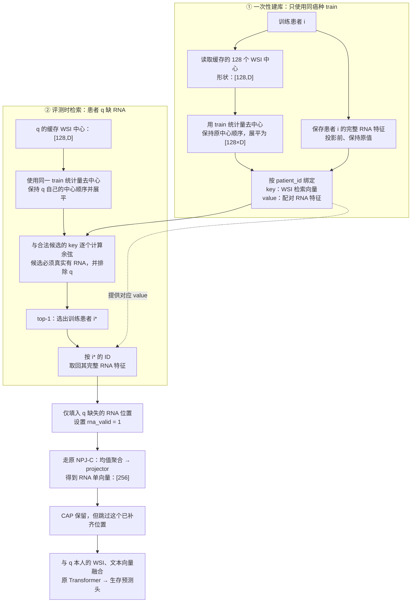
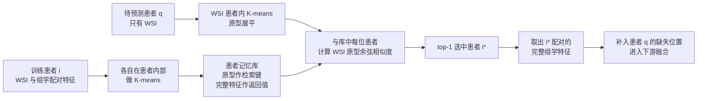
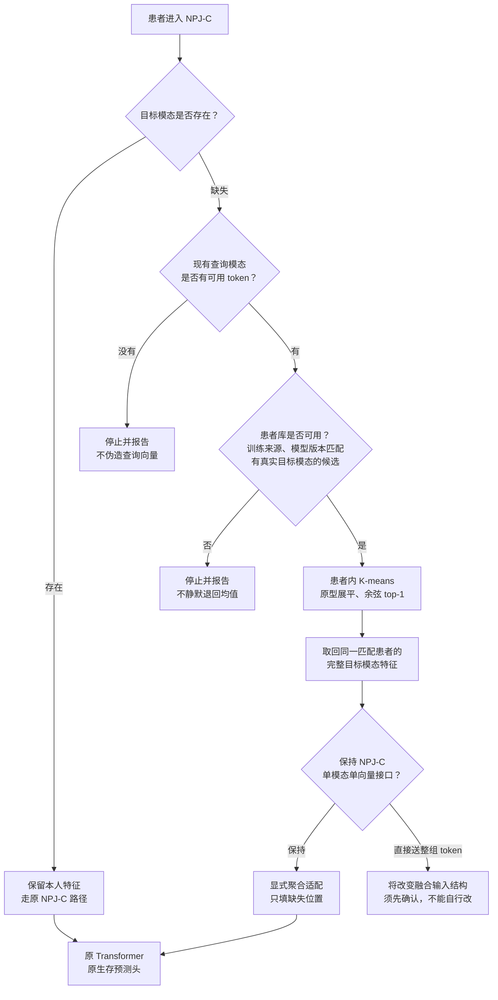

# TriModalSurv 开发与实验状态

  最**后核对：2026-09-10 22:57:49 JST（Asia/Tokyo；本次更新 I03 的 25-seed 均值表）
  用途**：统一记录现有四条主线及后续创新点的开发过程、实验批次、结果和证据。
  维护方式：人工／Agent 在完成工作后更新；本文件不是自动监控器，也不替代研究计划、原始日志或 [坑台账](collab/pitfalls.md)。

## 1. 工作方式（用户已确定）

 ~~**开发时**：一个开发目录、一个开发分支，各创新点通过独立模块和配置区分；共享训练、数据、评测入口的修改须记录影响范围。历史 branch 名只用于追溯，不再承载长期并行开发~~

- **全量运行时**：从确定的 commit 建立临时 worktree，作为冻结运行副本；训练、后续 seed 和评测都从该副本实际执行，运行期间不改源码，不引用开发目录里的可变源码。
- **结果保存**：日志、checkpoint、逐 seed 指标、配置和运行记录保存在临时 worktree 之外，使用独立 run ID，避免覆盖。
- **运行结束**：确认训练、评测及相关子进程已结束，结果与复现材料已保存，再删除临时 worktree；保留对应 commit 和结果入口。
- **实验授权**：记录计划规模不等于允许启动。仍遵守 [AGENTS.md](AGENTS.md) 的冒烟停机、互审及正式实验授权要求。

### 当前落地情况


| 事项                     | 本次核对状态                                               | 证据／缺口                                                                                                           |
| -------------------------- | ------------------------------------------------------------ | ---------------------------------------------------------------------------------------------------------------------- |
| 开发目录                 | `/Users/wuhao/Desktop/TriModalSurv`；外层当前分支为 `main` | 当前外层 HEAD：`c10b0230b9019062803fff2f9101c43eb073ae82`，仅表示本文件创建前的现场版本                              |
| C/D 共用代码             | 已有同一套模型入口                                         | `NPJ/main_survival.py` 同时创建 `NPJC` 与 `MainModalityMoE(fusion_type="mean")`                                      |
| 按模块＋配置整理四条主线 | **尚未完成统一整理**                                       | 现有补偿集中在`NPJ/model/compensator.py`；①②独立模块／配置尚未核实落盘                                             |
| 可用于冻结的完整源码     | **尚未形成已核实的统一版本**                               | `.gitignore` 忽略 `/NPJ/`；实际 `NPJ/` 是独立仓库且有未提交修改；外层跟踪的是 `code/NPJ/` 历史快照，不能默认两者一致 |
| 自动建立并使用冻结副本   | **尚未实现**                                               | 本地`train_launcher.py` 使用当前 `NPJ_ROOT` 执行训练；尚无自动建快照／切换运行目录的流程                             |

初始化时嵌套 `NPJ/` HEAD 为 `823efec02e32f91b7a6060055c947e1098ce9103`，分支名为 `E1-M³Surv-patient-level`，且存在未提交实现。**外层 commit 不能自动包含这些改动；正式冻结前须核实实际执行源码全部能由记录的版本恢复。** 本次只建立状态文件，不进行目录迁移、提交、训练或旧 worktree 清理。

## 2. 主线总览

ID 固定，不因改名或排序变化而重编号；后续从 `I05` 继续追加。`I03` 是历史对照战役，纳入统一记录，但不作为新创新点宣称。


| ID          | 名称                      | 底座                    | 开发阶段                       | 实验阶段／最近记录                              | 当前待处理事项                                         |
| ------------- | --------------------------- | ------------------------- | -------------------------------- | ------------------------------------------------- | -------------------------------------------------------- |
| [I01](#i01) | E1-M³Surv 患者级配对检索 | NPJ-C                   | 方案讨论；未核实独立实现       | 未登记有效实验批次；25 seed 为后续目标          | 锁定检索依据、查询模态和训练规则                       |
| [I02](#i02) | E1-M³Surv 人群级配对原型 | NPJ-C                   | 候选方案；未核实独立实现       | 未登记有效实验批次；25 seed 为后续目标          | 锁定聚类空间、配对方式、原型数和更新规则               |
| [I03](#i03) | NPJ-D／Dm／旧 E1 对照     | NPJ-D 与 NPJ-C          | 历史实现已归档                 | 五癌各 25 seed 已收官，报告 r6                  | 保留历史结果，供后续匹配对照使用                       |
| [I04](#i04) | CAP4 × L：时间箱内多原型 | **NPJ-C（用户已确定）** | 底座变更已定；实现与配置待迁移 | NPJ-C 尚无实验结果；已有冒烟仅属于旧 NPJ-D 版本 | 将 CAPL 接入 NPJ-C，明确新版本的同底座对照；未授权全量 |

阶段使用明确文字：方案讨论／开发中／待互审／冒烟中／冒烟结束／待正式授权／正式运行中／已收官／暂停／舍弃。没有运行核验时不要填写“运行中”。

`<a id="i01"></a>`

## 3. I01｜E1-M³Surv 患者级配对检索

## ~~【strategy-逻辑链条】👌

 ~~





### ~~① 输入：保留一个患者内部的多个 token~~

~~[确定] 作者这里使用的是 **编码后的特征序列** ，不是原始图片，也不是已经求均值的患者向量。省略 batch 维：~~

* ~~WSI 特征：`X_img_i = [N_i, 256]`[2000, 256]~~

  ```
  ↓ 在这一个患者内部做 K-means
  [32, 256]
  ```
* ~~组学特征：`X_omics_i = [T_i, 256]`~~

~~`N_i`、`T_i` 是这个患者各模态的 token 数。[作者特征构造](https://github.com/MCPathology/M2Surv/blob/21e68db4e5ce93e6e00e5f906ce4ce7fb552cd0d/models/model_M3Surv.py#L169-L237)~~

### ~~② 患者内部 K-means：把“这个人的多种特征”压成若干代表~~

~~保持跟NPG-C单模态单向量接口这句话是什么意思？这部分判断我不知道什么意思，以及判断后直接送入整组token又是什么意思~~

~~对患者 A 的 token 单独聚类，再对患者 B 单独聚类， **不能把所有患者的 token 混起来聚类** 。~~

~~作者的调用是：~~

```
一位患者的 WSI token：[N_i, 256] → 32 个中心：[32, 256]
一位患者的组学 token：[T_i, 256] → 16 个中心：[16, 256]
```

~~这里的 `32` 是 **每位患者的 WSI 原型数** ，不是患者数、全人群中心数，也不是生存时间箱数。该函数使用 `detach()` 后的~~~~特征做 K-means，聚类本身不通过梯度学习。[原型构造函数](https://github.com/MCPathology/M2Surv/blob/21e68db4e5ce93e6e00e5f906ce4ce7fb552cd0d/models/model_M3Surv.py#L346-L350)~~

### ~~③ 建患者库：原型和完整特征都保存~~

~~一位患者对应一组记录，包含：~~

```
患者 i
├─ WSI 原型：用于 WSI 查询
├─ WSI 完整特征：用于反方向补 WSI
├─ 组学原型：用于组学查询
└─ 组学完整特征：用于补组学
```

~~**“配对”指这两侧来自同一个患者。** 不是 WSI 第 1 个原型与组学第 1 个原型一一对应。[ProtoBank.save](https://github.com/MCPathology/M2Surv/blob/21e68db4e5ce93e6e00e5f906ce4ce7fb552cd0d/models/memory.py#L103-L113)~~

~~也就是病人A缺失RNA，通过wsi的特征，利用余弦相似度找到最相近的。病人B利用的wsi特征的相似度top-1的去填补自己所缺失的Rna特征~~

### ~~④ 原型展平：比较患者，而不是逐个挑原型~~

~~患者 q 的 WSI 原型：~~

```
[32, 256] → flatten → [8192]
```

~~库里每位患者的 WSI 原型也同样展平，然后计算：~~

~~
\]这一步比较的是  **WSI 对 WSI** 。患者 q 缺失组学，因此不需要、也不能拿其真实组学来查询。[ProtoBank.retrieveGene](https://github.com/MCPathology/M2Surv/blob/21e68db4e5ce93e6e00e5f906ce4ce7fb552cd0d/models/memory.py#L139-L156)~~

### ~~:⑤ top-1：选一个患者，再取这个人的配对特征~~

* ~~选中患者的 **完整组学特征序列** ；~~
* ~~不是其组学聚类中心；~~
* ~~不是多个患者的加权平均；
* ~~更不是患者 q 的真实组学被“恢复”了。[返回值实现](https://github.com/MCPathology/M2Surv/blob/21e68db4e5ce93e6e00e5f906ce4ce7fb552cd0d/models/memory.py#L158-L162)~~

## 决策树    --   #T



### 

[](./diagrams/111.excalidraw.svg)
[](./diagrams/222.excalidraw.svg)

# 

# 保持原接口：先汇总，再融合

```
借回的 50 个 RNA 向量
        ↓ 聚合，例如求均值
       1 个 RNA 向量
        ↓
1 个 WSI + 1 个 text + 1 个 RNA
        ↓
Transformer 输入：[3,256]
```

Transformer 看到的是  **RNA 的一个整体表示** 。

### 直接送整组 token：不先汇总，全部参加融合

```
借回的 50 个 RNA 向量，全部保留
        ↓
1 个 WSI + 1 个 text + 50 个 RNA
        ↓
Transformer 输入：[52,256]
```

### ~~⑥ 下游融合：这是迁入 NPJ-C 时真正需要适配的地方~~

~~[确定] 作者把取回的整组组学 token 与本人的 WSI token 送入融合；NPJ-C 当前则是 **每个模态一个向量** 。[作者融合位置](https://github.com/MCPathology/M2Surv/blob/21e68db4e5ce93e6e00e5f906ce4ce7fb552cd0d/models/model_M3Surv.py#L287-L300)~~

~~所以要区分：~~

> ~~**检索时不求患者均值** ；取回特征以后，为适配 NPJ-C 而聚合成一个模态向量，是另一件事。~~

~~后者属于迁移适配，不是作者原有的完整融合流程。~~

这~~里的 `32` 是 **每位患者的 WSI 原型数** ，不是患者数、全人群中心数，也不是生存时间箱数。该函数使用 `detach()` 后的特征做 K-means，聚类本身不通过梯度学习~~

## ~~二、每部分代码放在哪里~~

~~以下位置指实际嵌套仓库 `/Users/wuhao/Desktop/TriModalSurv/NPJ`。新增函数名均为建议，尚未实现。~~

### ~~数据入口：保留 token、患者 ID 和真实存在标记~~

~~位置：[TCGASurDataset.**getitem** (line 622)](vscode://file/Users/wuhao/Desktop/TriModalSurv/NPJ/loc_utils_3yr/tcga_dataset.py:622)。~~

~~已有 `patient_id`、模态数据和 `*_valid`，应该把这些信息传给记忆模块。这里负责 **提供数据和身份** ，不负责训练患者库或执行模型层检索。~~

~~注意：数据层已有的 [MiniBatchKMeans (line 424)](vscode://file/Users/wuhao/Desktop/TriModalSurv/NPJ/loc_utils_3yr/tcga_dataset.py:424) 是 WSI 输入压缩，不能直接视为作者那段“编码后特征的记忆原型构造”。~~

### ~~*算法主体：集中放一个独立模块*~~

~~建议新增：~~

~~`/Users/wuhao/Desktop/TriModalSurv/NPJ/model/patient_memory.py`~~


| ~~建议函数／职责~~                                       | ~~实现什么~~                                           |
| ---------------------------------------------------------- | -------------------------------------------------------- |
| ~~`build_patient_prototypes(features, k)`~~              | ~~对**一个患者**的 token 做 K-means，返回 `[K,d]`~~    |
| ~~`PatientPairedMemory`~~                                | ~~保存患者标识、各模态原型和配对完整特征~~             |
| ~~`retrieve_paired(query_prototypes, target_modality)`~~ | ~~展平、余弦比较、top-1，返回匹配患者及目标特征~~      |
| ~~库状态保存／恢复~~                                     | ~~记录库对应的模型版本、训练划分及有效患者，避免错配~~ |

~~不要把患者库塞进旧 CAP 的生存分箱／EMA 更新逻辑；两者存储的单位不同。~~

### ~~NPJ-C 接口：必须有“一前一后”两个位置~~

~~位置：[NPJC.forward (line 1139)](vscode://file/Users/wuhao/Desktop/TriModalSurv/NPJ/model/fusion_model.py:1139)。~~

**~~前位置：第 1145 行求均值之前，取得 token 级输入。~~**

```
模态输入 token
├─ 原 NPJ-C 路径：mean → m_projector
└─ 新检索旁路：保留 token → 检索特征适配 → 患者内原型
```

~~建议在 `NPJC` 内增加 `extract_memory_features()`，专门定义“NPJ-C 的哪些特征拿来建库和查询”。~~

~~这里有一个必须显式记录的适配：作者用自己的编码／图处理特征；NPJ-C 不能凭空拥有这些特征。若使用现有 `m_projector` 逐 token 投影，这是  **NPJ-C 的特征适配方案** ，不是原作者编码器。~~

 **~~不能顺手把正常模态路径从 `mean → project` 改成 `project → mean`** ，因为投影中有非线性，两者不等价。~~

**~~后位置：第 1182 行补偿调用附近，且在第 1193 行 `torch.stack` 之前。~~**

职责是：

```
取回整组目标特征
→ 显式适配成 NPJ-C 的单模态向量
→ 只替换缺失项
→ 成功补齐后更新有效标记
→ 原 Transformer 和生存预测头
```

现有补偿接口只收到池化后的向量，因此需要额外传入检索 token／原型；只更换一个类名不够。

### 训练与持久化：放在训练入口，不藏在数据读取里


| 位置                                                                                                                                                                                                              | 应负责什么                                                           |
| ------------------------------------------------------------------------------------------------------------------------------------------------------------------------------------------------------------------- | ---------------------------------------------------------------------- |
| [main_survival.py：参数与模型工厂 (line 173)](vscode://file/Users/wuhao/Desktop/TriModalSurv/NPJ/main_survival.py:173)                                                                                            | 增加独立补偿模式并实例化患者库，保留旧`capr/capl/bank`行为           |
| [批数据拆包 (line 391)](vscode://file/Users/wuhao/Desktop/TriModalSurv/NPJ/main_survival.py:391)                                                                                                                  | 把患者 ID 明确传到需要身份检查的记忆模块；当前 ID 被从模型输入中取出 |
| [训练循环 (line 893)](vscode://file/Users/wuhao/Desktop/TriModalSurv/NPJ/main_survival.py:893)                                                                                                                    | 控制何时建库／刷新；库来源限定训练患者，验证和测试只读               |
| [ModelDumper.dump (line 44)](vscode://file/Users/wuhao/Desktop/TriModalSurv/NPJ/loc_utils_3yr/model_util.py:44)与[测试加载处 (line 951)](vscode://file/Users/wuhao/Desktop/TriModalSurv/NPJ/main_survival.py:951) | 让模型 checkpoint 与相应患者库成对保存、恢复或核验                   |

**建库一次还是逐轮刷新，当前没有锁定。** 我这里只指出控制位置，不把某一种偷偷写成既定协议

- **问题**：用相似训练患者的配对表征补偿缺失模态，能否改善旧 CAP 的补偿效果？
- **机制候选**：A 缺 RNA 时，根据 A 的已有模态检索训练患者 B，取 B 真实存在的 RNA 表征，在 NPJ-C Transformer 融合前补入。补的是预测用表征，不是恢复 A 的真实基因表达。
- **历史名称**：`E1-M³Surv-patient-level`。
- **模块／配置入口**：独立入口待登记；目前只有 NPJ-C 的通用 `compensator` 接口。
- **已锁定边界**：旧 E1、E0m 不重训；新 E1-M³Surv 可单独训练；正式 25 seed 尚未授权。
- **尚未锁定**：是否保留作者代码中的患者内部原型；是否联合 WSI 与文本查询；记忆更新、训练损失、验收标准及具体运行范围。
- **命名边界**：若只存患者 token 并直接检索，称“患者级配对记忆检索”；保留患者内部原型后才可据实描述“原型引导”。不称为完整复现 M³Surv。
- **证据**：本对话的迁移讨论；本次未在实际 NPJ 入口中发现已注册的独立 M³Surv 实验臂。此项不是对其他主机实现情况的断言。
- **实验结果**：尚无已核实结果，不填写占位分数。

`<a id="i02"></a>`

## 4. I02｜E1-M³Surv 人群级配对原型

- **问题**：用一组患者的代表代替单个患者，能否减少检索补偿的个体噪声？
- **机制候选**：对训练人群聚类，保存对应的模态中心，通过已有模态检索相似原型，补偿缺失 RNA／文本表征。
- **历史名称**：`E1-M³Surv-prototype-level`。
- **模块／配置入口**：待登记；最终方案与独立实现尚未核实。
- **已锁定边界**：保留 NPJ-C 底座；旧 E1、E0m 不重训；不因分支已创建就认定方案已批准。
- **尚未锁定**：在哪个空间聚类、如何保持跨模态配对、K、初始化／刷新方式、训练协议与对照。不得把讨论中的可选项写成最终设置。
- **区分**：本候选是人群级聚类；作者公开代码中患者内部 token 聚类是另一层含义；I04 则受生存时间箱约束，三者不混同。
- **证据／实验结果**：来自本对话的候选讨论；尚无已核实实验结果。

`<a id="i03"></a>`

## 

5. I03｜NPJ-D／Dm／旧 E1：25-seed 历史对照

- **问题**：旧 E1 系统能否超过简单等权融合，以及直接训练集均值补偿？
- **实验臂**：D＝NPJ-A 去 GatedFusion、改等权平均；Dm＝同一 D checkpoint 在评测时均值补偿；旧 E1＝NPJ-C＋CAP-Recall＋modality dropout 0.15＋一致性损失 0.1。
- **范围**：BLCA、BRCA、LUAD、LGG、UCEC；每癌 25 seed：`123,132,213,231,321,1..20`；四格点 `none/rna_100/text_100/both_100`。
- **已核实阶段**：2026-09-07 三阶段收官，D 125 个 checkpoint；E1 补训 100 run，加原有 25 达到 125；Dm 125 次评测；归档记录 0 失败，报告 r6（E03）。
- **配置／历史入口**：`NPJ/scripts/train_launcher.py` 的 `d0/e1`；Dm 为复用 D checkpoint 的评测路径。历史分支 `NPJ-DVSE1VS均值补充（25seed）`。
- **解释边界**：E1 与 D 的底座和训练机制均有差异，是系统级比较；同 seed 是协议配对，不保证共享参数初始化相同；Dm 与 E0m 不是同一对象。
- **当前动作边界**：历史结果保留，不把本条登记视为重训请求。

### 25-seed 平均 C-index（B 口径）

每个单元格为同一癌种、实验臂、缺失场景下全部 **25 个 seed 的 C-index 算术平均值**：`mean = sum(cindex_B) / 25`。从原始 JSON 的完整精度计算，最后保留 4 位小数；所有异常 seed 原样纳入。每张表纵向为 5 个癌种，横向为 NPJ-D、Dm、旧 E1。

#### 不额外施加人工缺失（none）


| 癌种 |  NPJ-D |     Dm |  旧 E1 |
| ------ | -------: | -------: | -------: |
| BLCA | 0.5564 | 0.5564 | 0.5855 |
| BRCA | 0.7094 | 0.7079 | 0.6723 |
| LUAD | 0.5976 | 0.5974 | 0.5921 |
| LGG  | 0.7998 | 0.8012 | 0.7758 |
| UCEC | 0.6810 | 0.6849 | 0.6565 |

#### RNA 缺失 100%（rna_100）


| 癌种 |  NPJ-D |     Dm |  旧 E1 |
| ------ | -------: | -------: | -------: |
| BLCA | 0.5556 | 0.5569 | 0.5868 |
| BRCA | 0.7012 | 0.6990 | 0.6727 |
| LUAD | 0.5771 | 0.5846 | 0.5904 |
| LGG  | 0.7669 | 0.7692 | 0.7664 |
| UCEC | 0.6632 | 0.6839 | 0.6649 |

#### 文本缺失 100%（text_100）


| 癌种 |  NPJ-D |     Dm |  旧 E1 |
| ------ | -------: | -------: | -------: |
| BLCA | 0.5349 | 0.5348 | 0.5731 |
| BRCA | 0.6475 | 0.6357 | 0.6171 |
| LUAD | 0.6206 | 0.6212 | 0.5991 |
| LGG  | 0.7784 | 0.7763 | 0.6745 |
| UCEC | 0.6525 | 0.6538 | 0.6078 |

#### RNA 与文本均缺失 100%（both_100）


| 癌种 |  NPJ-D |     Dm |  旧 E1 |
| ------ | -------: | -------: | -------: |
| BLCA | 0.5353 | 0.5385 | 0.5716 |
| BRCA | 0.6346 | 0.6164 | 0.6157 |
| LUAD | 0.5884 | 0.6106 | 0.5983 |
| LGG  | 0.6653 | 0.7289 | 0.6456 |
| UCEC | 0.5709 | 0.6450 | 0.6121 |

计算核对（2026-09-10）：3 臂 × 5 癌 × 4 场景 × 25 seed＝1500 个原始读数，汇总为 60 个均值；每格 seed 集合完整，无重复、缺值或非有限值；D/Dm 的 checkpoint 路径逐一一致（125/125），缺失 manifest、逐场景遮挡指纹与 test 样本数一致。

来源：E03-R 归档 commit `0eb0abc4470941cee8cc08ebf1b203ffa5b6ba4d`。D/Dm 各 125 个结果 JSON；旧 E1 使用新增 100 个 JSON，加原 5 seed 的 `results_npjc/e1/`（25 个、3 场景）和 `results_npjc_both/e1/`（25 个、仅 both_100），按癌种／seed／场景合并。状态快照 JSON 不计入结果。B 为 sigmoid 修正后的评测读数，checkpoint 选择仍沿用历史 A 口径；下方原有“配对差中位数”另列保留。

<details>
<summary>均值计算与完整性核对代码（只读归档，可在项目根目录复算）</summary>

```python
import io, json, math, re, statistics, subprocess, tarfile
REV = "0eb0abc4470941cee8cc08ebf1b203ffa5b6ba4d"
D = "collab/20260906-NPJ-D消融/"
A = "collab/20260902-A测缺失补偿/"
SOURCES = {
    "NPJ-D": [D + "results_npjd_d0/"],
    "Dm": [D + "results_npjd_dm/"],
    "旧 E1": [A + "results_npjc/e1/", A + "results_npjc_both/e1/", D + "results_npjc_e1_25/"],
}
CANCERS = ["BLCA", "BRCA", "LUAD", "LGG", "UCEC"]
SEEDS = {123, 132, 213, 231, 321} | set(range(1, 21))
GRIDS = ["none", "rna_100", "text_100", "both_100"]
paths = [p.rstrip("/") for dirs in SOURCES.values() for p in dirs]
blob = subprocess.check_output(["git", "archive", REV, "--", *paths])
data, checkpoints, counts, metadata = {}, {}, {}, {}
with tarfile.open(fileobj=io.BytesIO(blob)) as archive:
    for member in archive:
        match = re.search(r"_([A-Z]+)_s([0-9]+)\.json$", member.name)
        if not member.isfile() or not match:
            continue
        arm = next(a for a, dirs in SOURCES.items() if any(member.name.startswith(p) for p in dirs))
        j = json.load(archive.extractfile(member))
        cancer, seed = match[1], int(match[2])
        assert j["cancer"] == cancer and j["seed"] == seed
        assert cancer in CANCERS and seed in SEEDS
        counts[arm] = counts.get(arm, 0) + 1
        ck = (arm, cancer, seed)
        assert ck not in checkpoints or checkpoints[ck] == j["checkpoint"]
        checkpoints[ck] = j["checkpoint"]
        for grid, row in j["grids"].items():
            assert grid in GRIDS
            k = (arm, cancer, seed, grid)
            assert k not in data, ("重复", k)
            v = row["cindex_B"]
            assert math.isfinite(v) and 0 <= v <= 1
            data[k] = v
            meta = (j["manifest_sha256"], row["grid_sha"], row["n_test"])
            mk = (cancer, grid)
            assert mk not in metadata or metadata[mk] == meta
            metadata[mk] = meta
expected = {(a,c,s,g) for a in SOURCES for c in CANCERS for s in SEEDS for g in GRIDS}
assert set(data) == expected and len(data) == 1500
for c in CANCERS:
    for s in SEEDS:
        assert checkpoints["NPJ-D",c,s] == checkpoints["Dm",c,s]
for g in GRIDS:
    print("\n#### " + g + "\n")
    print("| 癌种 | NPJ-D | Dm | 旧 E1 |")
    print("|---|---:|---:|---:|")
    for c in CANCERS:
        values = [statistics.mean(data[a,c,s,g] for s in sorted(SEEDS)) for a in SOURCES]
        print("| " + c + " | " + " | ".join(f"{v:.4f}" for v in values) + " |")
print("\n核对：1500 个原始值；60 个均值；每格 n=25；缺失/重复/非有限值=0；D/Dm checkpoint 一致 125/125。")
print("来源文件数：" + str(counts))
```

</details>

### 结果摘要：旧 E1 − Dm

以下为 r6 的 **B 口径 C-index 逐 seed 配对差值的中位数**，不是两组中位数相减；完整胜负平见 E03。


| 癌种 |     none |  rna_100 | text_100 | both_100 |
| ------ | ---------: | ---------: | ---------: | ---------: |
| BLCA |  +0.0071 |  +0.0021 |  +0.0429 |  +0.0364 |
| BRCA | −0.0274 | −0.0157 | −0.0018 |  +0.0057 |
| LUAD | −0.0086 |  +0.0044 | −0.0190 | −0.0119 |
| LGG  | −0.0269 | −0.0097 | −0.0911 | −0.0870 |
| UCEC | −0.0256 | −0.0171 | −0.0487 | −0.0314 |

按该历史战役的 0.02 噪声带，只有 BLCA 的缺文本／全缺格点超带正；不能写成普遍有效，也不自动把该判据套给新主线。`none` 表示不额外施加人工缺失，不保证每位患者天然三模态齐全。

`<a id="i04"></a>`

## 6. I04｜CAP4 × L：生存时间箱内多原型

- **问题**：每个时间箱从一个均值原型扩成多个原型，是否能保留箱内差异，并超过均值补偿？
- **当前底座／机制**：**NPJ-C**（用户于 2026-09-10 明确将后续开发底座由 NPJ-D 改为 NPJ-C）；4 个时间箱，每箱最多 L 个原型；K-means 初始化、箱内最近分配、EMA 更新。L=32 对应每模态最多 128 槽，样本不足的槽屏蔽。
- **变更状态**：本次更新方案记录，尚未修改训练代码／配置。后续使用 NPJ-C 的融合路径；新版本的同底座对照与运行配置待确定，旧 D_q／Dm_q 不能直接作为 NPJ-C 版本的单因素对照。
- **历史范围**：D_q、Dm_q、CAPL1／8／32；`q` 表示训练集未删失时间的分位数边界，train/valid/test 共用。原研究计划的全量规模尚未执行，不混入 r6 的作者分箱协议。
- **现有代码／旧配置入口**：`NPJ/model/compensator.py` 的 `CAPRecallMulti`；launcher 的 `dq0/dq_capl1/dq_capl8/dq_capl32` 对应旧 NPJ-D 版本。NPJ-C 版本的独立模块／配置入口尚未登记，不通过改名覆盖旧预设和结果。
- **历史名称**：`ProSurv-CAP4（生存时间箱数）＋L=32（每箱原型数）`；`prosurv-cap4-L32` 为同一主线别名。不是完整复现 ProSurv。
- **已核实阶段（旧 NPJ-D）**：E04 记载 v3 注意力尺度修复和 2026-09-08 重冒烟收官；CAPL32／CAPL1 各 BLCA seed 123、50 epoch、无 NaN。上述验收不能代替 NPJ-C 版本的验证。
- **归档判断（旧 NPJ-D）**：公式调整增大了相似度差异，但训练后锚依赖未增长；原记录要求收窄个体化召回声称，**不开全量**。这是旧版本结论，不能直接归因到尚未运行的 NPJ-C 版本。
- **当前实验状态（NPJ-C）**：尚无已核实结果；本次底座变更不等于训练或全量实验授权。

### 历史 NPJ-D 冒烟读数（B 口径 test C-index；单 seed，不作效果推广）


| 实验臂／版本                       | 癌种／seed |   none | rna_100 | text_100 | both_100 |
| ------------------------------------ | ------------ | -------: | --------: | ---------: | ---------: |
| D_q（v2 对照）                     | BLCA／123  | 0.5463 |  0.5085 |   0.5311 |   0.5125 |
| Dm_q（v2 对照，同 D_q checkpoint） | BLCA／123  | 0.5463 |  0.5585 |   0.5297 |   0.5517 |
| CAPL1（NPJ-D，v3）                 | BLCA／123  | 0.5307 |  0.5638 |   0.5031 |   0.5411 |
| CAPL32（NPJ-D，v3）                | BLCA／123  | 0.5293 |  0.5632 |   0.5047 |   0.5416 |

来源：E04 的 `smoke/v3/README.md`。全表均属于旧 NPJ-D 底座，保留对照版本差别；这些读数不是 NPJ-C 结果，也不是 25-seed 正式结果。本次只读历史归档，未重新运行测试、训练、评测或核验远端进程。

## 7. 开发过程记录（追加，不覆盖历史）

每次有实质变化，更新总览和对应主线说明，再追加一行。多人同时工作时先重新读取本文件；共享入口由当次明确的负责者合并，避免覆盖他人的记录。


| 日期（JST）                | 主线     | 类型               | 做了什么／为什么                                                       | 验证与证据                                                                          | 尚未解决／后续入口                                        |
| ---------------------------- | ---------- | -------------------- | ------------------------------------------------------------------------ | ------------------------------------------------------------------------------------- | ----------------------------------------------------------- |
| 2026-09-07（历史回填）     | I03      | 正式实验收官       | D、Dm、旧 E1 完成五癌各 25 seed 对照                                   | E03：报告 r6、三阶段收官日志                                                        | 结果只支持有限癌种／缺失格点，不作单模块归因              |
| 2026-09-07～08（历史回填） | I01／I02 | 方案讨论           | 区分患者级配对检索与人群级配对原型                                     | 本对话；没有独立实验批次证据                                                        | 查询、聚类、更新和验收仍需讨论                            |
| 2026-09-08（历史回填）     | I04      | 修复／重冒烟       | 调整注意力尺度，完成 CAPL1／32 重冒烟                                  | E04：归档测试、探针与 BLCA s123 日志；本次未复跑                                    | 锚依赖持平，原记录明确不开全量                            |
| 2026-09-10                 | 全项目   | 工作方式确定／登记 | 用户确定单目录单分支开发、commit 临时 worktree 冻结运行；创建本文件    | 本对话；Git 对象与当前本地源码只读核对                                              | 目录归集、源码归档及冻结启动入口尚未落地                  |
| 2026-09-10 22:45:09        | I04      | 用户裁决／底座变更 | 后续 CAP4 × L 开发底座由 NPJ-D 改为 NPJ-C；更新总览和主线定义         | 用户本轮明确要求；旧 D 冒烟数值保留并标明底座                                       | NPJ-C 实现／配置迁移及同底座对照待落实；尚无 C 版实验结果 |
| 2026-09-10 22:57:49        | I03      | 历史结果均值汇总   | 按癌种和实验臂新增四种缺失场景的 25-seed 算术平均 C-index 表（B 口径） | E03-R 原始 JSON 共 1500 个读数；60/60 均值经 Decimal 独立求和一致；复算代码附于 I03 | 仅汇总既有结果；未新增训练或评测                          |

Bug 详情仍按项目格式记入所属战役的 `notes.md`，Prevention Rule 回到唯一坑台账；本表只放摘要和链接，不另建重复问题台账。

## 8. 实验批次记录

此表记录批次，逐癌／逐 seed／逐格点原始明细放结果文件中。代码版本、结果路径未知时明确写“待补录”，不把归档 commit 当成当时的训练 commit。


| 批次 ID                                        | 主线／类型               | 运行范围                              | 实际运行源码版本                     | 状态／结果入口                      |
| ------------------------------------------------ | -------------------------- | --------------------------------------- | -------------------------------------- | ------------------------------------- |
| `npjd_full_d0`／`npjd_full_e1`／`npjd_full_dm` | I03／历史正式战役        | 五癌各 25 seed；E1 本批补 seed 1–20  | 待从当时部署记录补录；E03 为归档版本 | 已收官；E03 的 results、logs、r6 表 |
| `capl_smoke`                                   | I04／旧 NPJ-D／v2 冒烟   | BLCA／123；D_q、CAPL32、Dm_q          | 待从当时部署记录补录                 | 已结束；E04 的`smoke/`              |
| `capl_smoke_v3`                                | I04／旧 NPJ-D／v3 重冒烟 | BLCA／123；CAPL32、CAPL1，各 50 epoch | 待从当时部署记录补录                 | 已结束，全量暂停；E04 的`smoke/v3/` |

### 后续每个批次复制此模板

```markdown
### RUN-<主线ID>-<日期>-<序号>

- 主线／实验臂／目的：
- 底座／模型类型／补偿方法／分箱协议（不能只写主线 ID）：
- 类型与阶段：冒烟／正式；待授权／运行中／成功／失败／中止
- 执行者、复核者、正式运行授权记录：
- 开始／结束／最近核验时间（JST）：
- 运行主机／GPU／环境版本：
- 源码 commit（若仍涉及嵌套仓库，分别记录且确认无未提交执行源码）：
- 冻结 worktree 路径／实际 cwd／训练与评测入口：
- 完整启动命令／resolved config 路径及 hash：
- 数据与特征版本／split／分箱规则／缺失 manifest 及 hash：
- 癌种／完整 seed 列表／缺失格点：
- 配对对照／复用 checkpoint／指标 A 或 B／checkpoint 选择口径：
- checkpoint／日志／逐 seed 原始结果／汇总表的持久路径：
- 完成、失败、跳过、待运行数量／进程状态与退出码证据：
- 结果：绝对值、相对哪个对照、聚合方式、有效样本数；无结果则写未完成
- 解释边界／失败原因／用户后续裁决：
- 收尾：所有进程结束、结果与复现材料已保存、临时 worktree 删除时间
```

## 9. 后续创新点登记模板

---

---

新增时分配下一个 ID，在总览新增一行，并复制以下卡片；开发日志、运行批次继续追加到本文件。独立结果／计划文件通过路径关联，不将所有原始日志堆入 STATUS。

```markdown
<a id="i05"></a>

## I05｜<名称>

- 一句话问题：
- 类型：新机制／消融／历史对照
- 底座／机制／与已有主线的区别：
- 模块路径／配置目录／启动预设：
- 对照与必须一致的实验协议：
- 已锁定事项／尚未决定事项：
- 当前开发阶段／负责者／复核记录：
- 当前实验阶段／最近批次 ID／结果入口：
- 结果结论与解释边界：
- 下一项待处理事项／用户裁决记录：
- 最近更新时间／证据：
```

## 10. 历史证据索引

下列部分资料保存在其他 Git 提交中，当前 `main` 下未必存在。使用 `git show` 只读查看，无须切换开发分支。


| 编号  | 归档 commit                                | 路径／定位                                                                                                                                                 | 支持内容                                                                        |
| ------- | -------------------------------------------- | ------------------------------------------------------------------------------------------------------------------------------------------------------------ | --------------------------------------------------------------------------------- |
| E03   | `0eb0abc4470941cee8cc08ebf1b203ffa5b6ba4d` | `collab/20260906-NPJ-D消融/notes.md`：三阶段收官段；`collab/20260902-A测缺失补偿/a_test_report.md`：二 d 节                                                | 25-seed 完成记录、方法定义、r6 指标                                             |
| E03-R | 同 E03                                     | `collab/20260906-NPJ-D消融/` 中的 `results_npjd_d0/`、`results_npjd_dm/`、`results_npjc_e1_25/`、`r6_numbers.txt`、`table_npjd_D_Dm_E1_absolute_25seed.md` | 原始结果与全量表；E1 新目录只含新增 100 份，原 5 seed 结果由历史资料合并使用    |
| E04   | `f2e2358db706127862631b3dd577d9f9c2a6b239` | `collab/20260907-ProSurv-CAP4-L32/research_plan.md`；`notes.md` 末尾指挥官收口；`smoke/v3/README.md`                                                       | 旧 NPJ-D 版 CAPL 方法、研究范围、v3 重冒烟结果及停机状态；不代表当前 NPJ-C 方案 |
| E04-R | 同 E04                                     | `collab/20260907-ProSurv-CAP4-L32/smoke/` 与 `smoke/v3/` 下的 JSON、日志、探针                                                                             | 单 seed 冒烟原始证据                                                            |

```bash
git show '0eb0abc:collab/20260902-A测缺失补偿/a_test_report.md'
git show 'f2e2358:collab/20260907-ProSurv-CAP4-L32/notes.md'
git show 'f2e2358:collab/20260907-ProSurv-CAP4-L32/smoke/v3/README.md'
```

更新要求：事实标注 `[确定]` 或给出可查证据；推断注明 `[较确定]`；未确认事项写 `[不确定]`／待核实。本文件的“已收官”只用于已有退出状态、产物完整性和归档记录支持的实验；新增批次仍需重新核验，不继承历史授权或效果结论。

### ① 输入：保留一个患者内部的多个 token

[确定] 作者这里使用的是 **编码后的特征序列** ，不是原始图片，也不是已经求均值的患者向量。省略 batch 维：

* WSI 特征：`X_img_i = [N_i, 256]`
* 组学特征：`X_omics_i = [T_i, 256]`

`N_i`、`T_i` 是这个患者各模态的 token 数。[作者特征构造](https://github.com/MCPathology/M2Surv/blob/21e68db4e5ce93e6e00e5f906ce4ce7fb552cd0d/models/model_M3Surv.py#L169-L237)

### ② 患者内部 K-means：把“这个人的多种特征”压成若干代表

对患者 A 的 token 单独聚类，再对患者 B 单独聚类， **不能把所有患者的 token 混起来聚类** 。

作者的调用是：

```
一位患者的 WSI token：[N_i, 256] → 32 个中心：[32, 256]
一位患者的组学 token：[T_i, 256] → 16 个中心：[16, 256]
```

这里的 `32` 是 **每位患者的 WSI 原型数** ，不是患者数、全人群中心数，也不是生存时间箱数。该函数使用 `detach()` 后的特征做 K-means，聚类本身不通过梯度学习。[原型构造函数](https://github.com/MCPathology/M2Surv/blob/21e68db4e5ce93e6e00e5f906ce4ce7fb552cd0d/models/model_M3Surv.py#L346-L350)

### ③ 建患者库：原型和完整特征都保存

一位患者对应一组记录，包含：

```
患者 i
├─ WSI 原型：用于 WSI 查询
├─ WSI 完整特征：用于反方向补 WSI
├─ 组学原型：用于组学查询
└─ 组学完整特征：用于补组学
```

**“配对”指这两侧来自同一个患者。** 不是 WSI 第 1 个原型与组学第 1 个原型一一对应。[ProtoBank.save](https://github.com/MCPathology/M2Surv/blob/21e68db4e5ce93e6e00e5f906ce4ce7fb552cd0d/models/memory.py#L103-L113)

### ④ 原型展平：比较患者，而不是逐个挑原型

患者 q 的 WSI 原型：

```
[32, 256] → flatten → [8192]
```

库里每位患者的 WSI 原型也同样展平，然后计算：

\[
s_i=\cos\left(\operatorname{vec}(P_q^{img}),
             \operatorname{vec}(P_i^{img})\right)
\]这一步比较的是  **WSI 对 WSI** 。患者 q 缺失组学，因此不需要、也不能拿其真实组学来查询。[ProtoBank.retrieveGene](https://github.com/MCPathology/M2Surv/blob/21e68db4e5ce93e6e00e5f906ce4ce7fb552cd0d/models/memory.py#L139-L156)

### ⑤ top-1：选一个患者，再取这个人的配对特征

\[
i^*=\arg\max_i s_i,\qquad
\widehat X_q^{omics}=X_{i^*}^{omics}
\]因此补回去的是：

* 选中患者的 **完整组学特征序列** ；
* 不是其组学聚类中心；
* 不是多个患者的加权平均；
* 更不是患者 q 的真实组学被“恢复”了。[返回值实现](https://github.com/MCPathology/M2Surv/blob/21e68db4e5ce93e6e00e5f906ce4ce7fb552cd0d/models/memory.py#L158-L162)

### ⑥ 下游融合：这是迁入 NPJ-C 时真正需要适配的地方

[确定] 作者把取回的整组组学 token 与本人的 WSI token 送入融合；NPJ-C 当前则是 **每个模态一个向量** 。[作者融合位置](https://github.com/MCPathology/M2Surv/blob/21e68db4e5ce93e6e00e5f906ce4ce7fb552cd0d/models/model_M3Surv.py#L287-L300)

所以要区分：

> **检索时不求患者均值** ；取回特征以后，为适配 NPJ-C 而聚合成一个模态向量，是另一件事。

后者属于迁移适配，不是作者原有的完整融合流程。

<a id="refactor-20260916-002337"></a>

## 渐进重构记录｜2026-09-16T00:38:56+09:00

本段只追加；上方原文、删除线、下划线及既有链接全部保留。本轮为工程重构与零训练回归，不改变历史科研结论。

### 新增、迁移与保全

- 公共骨架新增 `src/trimodalsurv/`，先迁 I01 依赖；data/training 仅保留职责边界，其他训练线路仍用旧入口。
- I01 真实检索算法迁入 [model.py](experiments/I01_patient_retrieval/model.py)，投影前填补位置标记 `# [创新 I01-01]`；NPJC 参数键和 mean→projector 顺序保持。
- [I01 知识索引](experiments/I01_patient_retrieval/knowledge/index.md)连接原文、新机制图与结果；旧 MD/SVG 不回写。
- [I02 权重保全](experiments/I02_population_prototypes/results/formal-k8-es15-e100-v1/analysis.md)：25/25，145677260 字节，本地与 hitode 源端大小、MD5、SHA-256 一致；landau 另有持久副本。
- 源码快照：774f → `6a04a0bf5c283a57e90207899ddffe3867fd5e0a`；684e → `443b27d8fbafa12a458c35e29890146f065c2f17`。各有受保护分支，按清单提交，未将日志/预测/权重混入源码提交。
- 历史源码归档至 `archive/legacy_npj_snapshot/`；旧开发目录和入口保留，尚未退役。根与独立 NPJ 的既有改动已记录，未覆盖。

### 实际验收

- [I01 对拍](experiments/I01_patient_retrieval/results/refactor-parity-20260916-002337/audit/parity.json)：BLCA seed123 E0，排序前32个test患者，完整train库，3臂×4格；donor/mask/填补输入/库一致，投影、logits、A/B风险最大绝对差异均为0，阈值atol=1e-6、rtol=0。
- [生效配置](experiments/I01_patient_retrieval/results/refactor-preflight-20260916-002337/resolved_config.yaml)：真实新入口预检成功，实际模型hidden_size=256；历史训练未知参数明确保留未记录。
- 初次完整单元测试66项通过；修复汇总器识别新manifest的问题后，针对汇总的29项测试通过。没有训练或新增正式C-index。
- SVG嵌入可编辑场景与原scene一致，完整渲染目视通过；本地编辑器访问超时，尚未完成GUI编辑保存验收。

### 后续入口与范围

- [通用科研初始化 Markdown](docs/templates/experiment-oriented-ml-template.md)：可直接提供给AI；不生成Skill或CLI。
- [重构交付与旧→新映射](docs/refactor/20260916-002337/README.md)。
- I02本轮仅保全；I03/I04及其他训练骨架没有迁移。冒烟通过后停止，后续迁移与正式实验另行确认。
