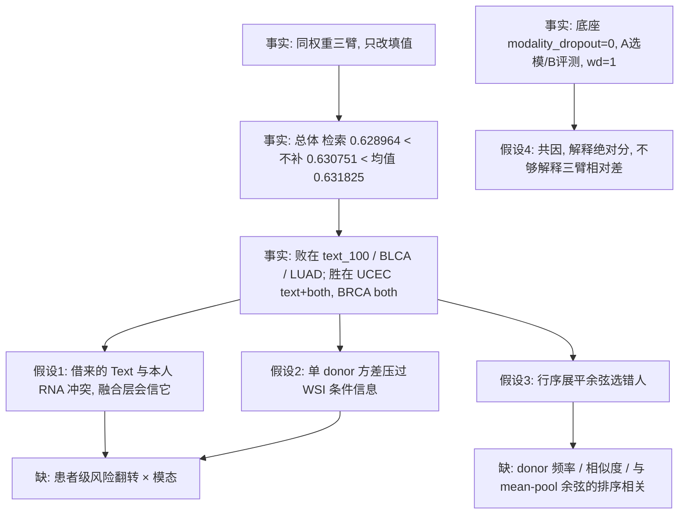
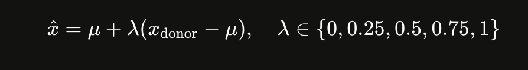
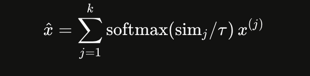
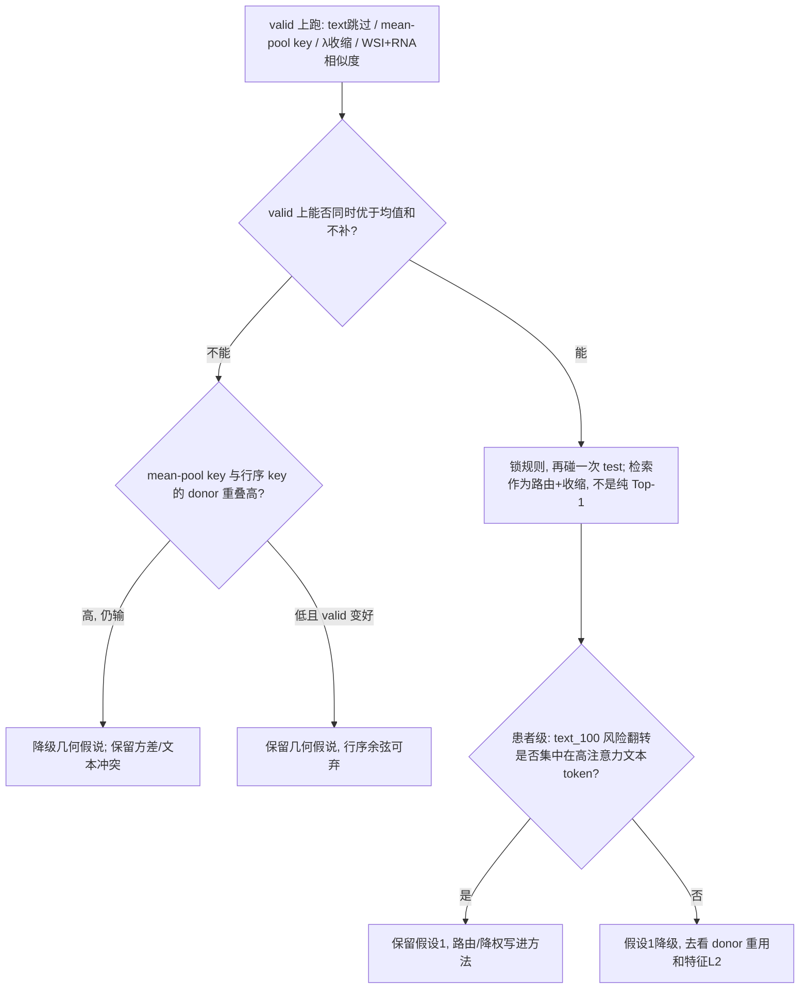

本轮读了 4 份附件（诊断提示词、总实验 map、癌种表、seed 表）并做了网页检索。本地 JSON/audit 没挂进来，donor 分布、相似度直方图、风险翻转都还没看到。下面按**已有 C-index 矩阵**作答，不润色 prompt。

**一句话：** `patient-fixed-padmask-v2` 在冻结 NPJ-C、只换推理填值时，**没有证明患者检索无效**；它证明的是——用**乱序 128×1536 展平余弦**选 **Top-1 整患者**、再把外来 token 以 `valid=true` 全权送进**为 mask 缺失而不是为吞邻居而训的**融合层，总体会输给均值和不补。现成矩阵里已经藏着能把总均值翻正的规则，不需要 CAP / InfoNCE。

三个优先假设（按对这张表的解释力）：

1. 错配文本在 RNA 仍在时是毒药（~~**text_100 大出血，both_100 相对不补却能回血**~~）。
2. **Top-1 单患者方差 > 条件信息**（所以均值经常赢检索）。
3. **检索几何和模型真正吃的 WSI 不是一回事**（独立 K-means 行序展平 vs 融合前 128 行 mean）。

---

## 主因链

实线是矩阵和源码能撑住的；虚线假设还没被中间量拆开。

---

## 证据对照（机制名不能当证明）

### **假设1｜借来的 Text 在 RNA 还在时是毒药**

|      |                                                                                                                                                                                                                                                                                                                                   |
| ------ | ----------------------------------------------------------------------------------------------------------------------------------------------------------------------------------------------------------------------------------------------------------------------------------------------------------------------------------- |
| 支持 | LGG/text_100：检索相对不补**−0.054**；BRCA/text**−0.026**；LUAD/text**−0.021**；BLCA/text**−0.026**。同一套 donor 规则，LGG/both_100 相对不补 **+0.054**——WSI-only 太弱时，随便填都比不填好。底座是 Song 等 BIB 2026 那套 **gated/mask 缺失、不强制填** 的 NPJ，训练 `modality_dropout=0`，没见过“本人 RNA + 别人 Text”。 |
| 反例 | UCEC/text、UCEC/both 检索稳定赢。说明不是“凡借文本必炸”，是癌种/文本信息量/冲突强度不同。                                                                                                                                                                                                                                       |
| 缺   | 同患者 text_100 vs both_100 的风险秩变化；填入 token 与本人 RNA token 的注意力权重。                                                                                                                                                                                                                                              |

### **假设2｜Top-1 方差压过条件信息**

|      |                                                                                                                                                                                                                                                                                                                                                                                                                                                                                                                                     |
| ------ | ------------------------------------------------------------------------------------------------------------------------------------------------------------------------------------------------------------------------------------------------------------------------------------------------------------------------------------------------------------------------------------------------------------------------------------------------------------------------------------------------------------------------------------- |
| 支持 | 100 组对均值 32/5/63。rna_100 三臂几乎贴在一起（Δ 千分位），个体化没带来额外信号。MICCAI 2025 记忆库论文（[arXiv:2506.19324](https://arxiv.org/abs/2506.19324)，Qu 等，M³Surv 会议前身）在**训练期动量写入的配对隐空间**里检索，且用 top-μ softmax；他们也没拿冻结缓存 Top-1 去打均值填补。DisPro（[arXiv:2503.01653](https://arxiv.org/abs/2503.01653)）直接写：单样本检索有可观随机性。M3Care（[KDD 2022](https://arxiv.org/abs/2210.17292)）在隐空间用邻居图 + 可学门控，**不用 raw Top-1**；其消融里把深度核换成余弦就掉点。 |
| 反例 | UCEC 五 seed 在 text/both 上都正，BRCA/both 也正——条件信息有时够用。                                                                                                                                                                                                                                                                                                                                                                                                                                                              |
| 缺   | donor 重用次数、Top-1 vs 均值的特征 L2、λ-shrinkage 扫描。                                                                                                                                                                                                                                                                                                                                                                                                                                                                         |

### **假设3｜检索几何 ≠ 模型几何**

|      |                                                                                                                                                                                       |
| ------ | --------------------------------------------------------------------------------------------------------------------------------------------------------------------------------------- |
| 支持 | 融合只对 WSI**128 行 mean → Linear(1536,256)**；检索却拿独立 MiniBatchKMeans 的**原行序**做 128×1536 展平余弦。padmask 只丢掉补零，不解决中心置换。这是结构事实，还不是已定位主因。 |
| 反例 | 若几何完全是噪声，UCEC/BRCA 的稳定正 Δ 不好解释。                                                                                                                                    |
| 缺   | 同一批 query：行序展平排序 vs valid-row mean 的 1536 维余弦排序，Kendall τ；以及两种 key 选出的 donor 重叠率。                                                                       |

**不单独列为一号：A选模/B评测、wd=1、epoch=50。** 这些是三臂**共因**，能解释 BLCA seed 213 在 none 上三臂并列 **0.491**（日志重建 best 轮=2，底座崩了），**解释不了同 checkpoint 上检索相对均值/不补更差**。

文献边界（避免把别人的正结果偷成你的）：Qu 等会议版癌种是 BLCA/BRCA/CO-READ/HNSC/STAD，检索的是**训练中更新的隐向量**，不是你的预投影缓存；μ=1 在他们设定里最好，**不能**反过来说你也该死守 Top-1。M3Care 是 EHR，不是 WSI–RNA–Text。M³Surv 期刊版（MedIA 2026）ScienceDirect 403，原型库细节我没读到原文，不编 K 和更新式。

---

## 灰色操作（按“这周能动数字”排序）

原则：先吃**已经写在表里的红利**，再动检索几何；能 valid 锁定的不要在 test 上挑。重训放后面。

### 0. 免费上限：你们已经有一个能赢的“方法”，只是没把它定义成方法

100 组里独胜：检索 17、均值 39、不补 39、并列 5。若每格取三臂最高，总体一定高于 0.631825。这不是理论，是这张表的逐格 max。

下面用规则逼近这个 oracle，而不是换骨干。

### 1. 第一条就能翻总均值：text_100 默认不补

text_100 五癌均值：

| 癌   | 检索      | 均值  | 不补      | 检索−不补 |
| ------ | ----------- | ------- | ----------- | ------------ |
| BLCA | 0.550     | 0.575 | **0.576** | −0.026    |
| BRCA | 0.629     | 0.619 | **0.655** | −0.026    |
| LGG  | 0.652     | 0.664 | **0.706** | −0.054    |
| LUAD | 0.576     | 0.595 | **0.597** | −0.021    |
| UCEC | **0.598** | 0.578 | 0.589     | +0.008     |

规则（先在 **valid** 上锁死，不要用 test 挑癌）：

- 只缺 Text、RNA 还在 → **m0real**（UCEC 若 valid 也支持检索，单独开例外）
- 只缺 RNA → 维持检索或均值（这格本来就在噪声里）
- 双缺 → 检索与均值的 shrinkage（见第 3 条），不要走不补（LGG/BRCA 双缺不补会塌）

粗算：text_100 占 25/100 格。四癌改走不补、UCEC 仍检索，text 切片大约 +0.025，总体大约 **+0.006**。当前检索 0.628964 会到 ~0.635，**高于均值 0.631825 和不补 0.630751**。

论文说法术：“complementarity-aware skip / 可恢复性路由”——RNA 已在时不注入跨患者 Text。这和 NPJ 骨架“能 mask 就 mask”是同一方向，不是新模块。

### #TODO-2. 零训练改 key：按模型实际吃的 WSI 检索 #TODO

现在：`vec(128×1536)`，行序来自每患者独立 K-means。
改成：对 valid 行做 mean，得到 **1536-d**，去中心后余弦。

	更狠一点：过一遍冻结 `img` projector，用 **256-d token** 做 key（train 集 forward 一次，不更新权重）。

理由：融合层从未看见 128 个原型 token。你在一个模型不用的几何里找“相似患者”，等于用错身份证。这是对 M3Care 消融的廉价抄法——他们余弦版明显弱于任务相关核，你至少先让 key 和模型输入一致。

### 3. James-Stein 收缩：让检索最坏等于均值 #TODO

<math xmlns="http://www.w3.org/1998/Math/MathML" display="block">
  <mrow data-mjx-texclass="ORD">
    <mi data-mjx-auto-op="false">score</mi>
  </mrow>
  <mo>=</mo>
  <mi>cos</mi>
  <mo data-mjx-texclass="NONE">⁡</mo>
  <mo stretchy="false">(</mo>
  <msub>
    <mrow data-mjx-texclass="ORD">
      <mi data-mjx-auto-op="false">WSI</mi>
    </mrow>
    <mi>q</mi>
  </msub>
  <mo>,</mo>
  <msub>
    <mrow data-mjx-texclass="ORD">
      <mi data-mjx-auto-op="false">WSI</mi>
    </mrow>
    <mi>d</mi>
  </msub>
  <mo stretchy="false">)</mo>
  <mo>+</mo>
  <mi>α</mi>
  <mi>cos</mi>
  <mo data-mjx-texclass="NONE">⁡</mo>
  <mo stretchy="false">(</mo>
  <msub>
    <mrow data-mjx-texclass="ORD">
      <mi data-mjx-auto-op="false">RNA</mi>
    </mrow>
    <mi>q</mi>
  </msub>
  <mo>,</mo>
  <msub>
    <mrow data-mjx-texclass="ORD">
      <mi data-mjx-auto-op="false">RNA</mi>
    </mrow>
    <mi>d</mi>
  </msub>
  <mo stretchy="false">)</mo>
</math>

**valid 上选 λ，网格必须包含 0。** λ=0 就是 m1（是均值补偿，不是不补偿），所以这条在 valid 准则下**不可能系统性差过均值**。UCEC/BRCA 若真有个体信号，λ 会停在 0.25–0.5，把方差砍掉，正 Δ 留下。

再抄 Qu 等的公式（他们 μ=1 时退化成 Top-1；你这边要的是 μ=5 的保险）：

k=5、τ∈{0.05,0.1,0.2}，valid 选。双缺仍用同一组权重，RNA/Text 一起加权，配对不拆。

### 4. 有 RNA 时不要只用 WSI 找人（text_100 专属） #TODO

现在无论缺什么，相似度**只用 WSI**。text_100 时本人 RNA 是现成的。M3Care 的核心就是：**只用未缺失模态找邻居**。

直接抄成加法（valid 选 α）：

<math xmlns="http://www.w3.org/1998/Math/MathML" display="block">
  <mrow data-mjx-texclass="ORD">
    <mi data-mjx-auto-op="false">score</mi>
  </mrow>
  <mo>=</mo>
  <mi>cos</mi>
  <mo data-mjx-texclass="NONE">⁡</mo>
  <mo stretchy="false">(</mo>
  <msub>
    <mrow data-mjx-texclass="ORD">
      <mi data-mjx-auto-op="false">WSI</mi>
    </mrow>
    <mi>q</mi>
  </msub>
  <mo>,</mo>
  <msub>
    <mrow data-mjx-texclass="ORD">
      <mi data-mjx-auto-op="false">WSI</mi>
    </mrow>
    <mi>d</mi>
  </msub>
  <mo stretchy="false">)</mo>
  <mo>+</mo>
  <mi>α</mi>
  <mi>cos</mi>
  <mo data-mjx-texclass="NONE">⁡</mo>
  <mo stretchy="false">(</mo>
  <msub>
    <mrow data-mjx-texclass="ORD">
      <mi data-mjx-auto-op="false">RNA</mi>
    </mrow>
    <mi>q</mi>
  </msub>
  <mo>,</mo>
  <msub>
    <mrow data-mjx-texclass="ORD">
      <mi data-mjx-auto-op="false">RNA</mi>
    </mrow>
    <mi>d</mi>
  </msub>
  <mo stretchy="false">)</mo>
</math>

α∈{0.5,1,2}。这是为了让借来的 Text 跟**本人 RNA** 同一侧，专门打假设1。双缺没有 RNA，这条用不上。

### 5. 不要把借来的 token 当成 valid=1.    #TODO 借来的权重系数->最差变成不补充

融合 pooling 是 `sum(h·valid)/sum(valid)`。检索和均值都把缺失位打成 True，外来模态和本人 WSI **同等权重**。

灰改法（一行）：缺失位 `valid_weight=0.3`（0.2/0.3/0.5 走 valid）。不补模块、不改权重。效果等价于“半信邻居”，接近 M3Care 的 β 门，只是冻成常数。对 text_100 尤其狠，因为它就是被这个 1.0 权重打死的。

### 6. 分癌固定策略（valid 锁定，禁止 test 刷）

从五 seed 均值看，粗规则已经稳定：

| 癌   | rna_100      | text_100 | both_100             |
| ------ | -------------- | ---------- | ---------------------- |
| UCEC | 均值         | **检索** | **检索**             |
| BRCA | 检索（极窄） | **不补** | **检索**             |
| LGG  | 均值         | **不补** | 均值（或 shrinkage） |
| LUAD | 随便         | **不补** | 均值                 |
| BLCA | 不补         | **不补** | 均值                 |

BLCA/none 138/138 全完整，三臂必须一样，别在总表里当检索胜利。

### 7. 要重训才动的抄参（动绝对分，不保证相对检索反超）

这些是“把别人能跑起来的数换上”，不是新架构：

| 现况（E0 重建）                      | 换成                                                                                                                                               | 为什么是灰的                                                                                                                                                        |
| -------------------------------------- | ---------------------------------------------------------------------------------------------------------------------------------------------------- | --------------------------------------------------------------------------------------------------------------------------------------------------------------------- |
| `weight_decay=1`（Adam）             | AdamW**1e-5** 或 1e-4                                                                                                                              | 同任务论文常见 1e-5（如[2511.18089](https://arxiv.org/html/2511.18089v1)）或 0.01；wd=1 大了 2–5 个数量级。BLCA seed 213 轮 2、C-index 0.49，很像被正则/选模打死。 |
| valid**A 风险**存盘，test **B 风险** | 存盘和评测都用 B                                                                                                                                   | 你已经在评 B；用 A 选出来的权重对 B 不必最优。seed 213 检索相对最好，可能只是“B 上没崩的那份”。                                                                   |
| `modality_dropout=0`                 | **0.3–0.5**，mask 的位置有时填均值。   #TODO 训练环节和rna_100、text_100、both_100`modality_dropout保持一致，测试环节的三模态是完整的 | 不这样，任何推理填值对融合层都是 OOD。这是检索/均值一起在 text_100 输给不补的训练侧原因。                                                                           |
| 50 epoch、无早停                     | patience=15，max 100–200，**B C-index**                                                                                                           | 你以后方案里已经写了；E0 不是它。LGG 跑满 50、BLCA 213 停在 2，不能混着解释检索。                                                                                   |
| 学习率 1e-4 不变                     | 1e-4 起步 + ReduceLROnPlateau（盯 valid B）                                                                                                        | 抄生存融合常用表，不是新算法。                                                                                                                                      |

重训解决的是**底座质量**。三臂相对差要靠 1–5 条。不要指望“只改 lr”让乱序 Top-1 突然胜过均值。

### 明确先别做

- 加 CAP / 跨注意力 / InfoNCE：当前失败条件还没定位到“缺对齐模块”；对齐损失在 text_100 上也可能继续灌错误文本。
- 用 seed 213 或 UCEC 当全文结论：213 是相对增益最大，321 是检索绝对最高；五 seed 不是五个队列。
- 把 K 改成 8：那是 I02，和本协议无关。
- 没看 audit 就宣布“生物学解耦”或“对抗噪声”：OOD 可以讲，adversarial 不行。

最少中间量（不要列几十项）：

1. **valid** 上四条灰规则的 C-index（不是 test 扫描）。
2. 行序 key vs mean-pool key 的 donor 重叠 + 排序相关。
3. 每个 cancer×scene：Top-1 特征到均值的 L2，以及 λ=0.5 的 C-index。
4. text_100：检索 vs 不补的患者风险秩差，按是否“高 sim / 低频 donor”切开。

有这四项就能在假设1–3里砍掉至少一条。没有它们，加模块是猜。

---

## 拍板前要你定的边界

1. 下一刀是 **零训练改推理**（1–5）还是 **先重训底座**（7）？前者才能回答“检索协议是否被证伪”；后者回答“E0 够不够格当底座”。
2. 路由/λ 是否允许 **valid 锁定、test 一次**？允许就能写进方法；不允许就只能当诊断。
3. 总表是否继续等权纳入 none（BLCA 五组三臂相同、冲淡 Δ）。口径你已经定过，改的话新旧表必须分开。
4. 不要把 I02 的 K=8、200 epoch 写进本轮负结果的“本应如此”。

---

**研究记录用的克制总结：** 在 `patient-fixed-padmask-v2`（K=128、冻结 25 个 E0、Top-1、行序 padmask 余弦、预投影 value、B 口径）下，四场景等权 100 组的患者检索 C-index 为 0.628964，低于均值填补 0.631825 与不补偿 0.630751（对均值 32 胜 5 平 63 负）。负向集中在 text_100 与 BLCA/LUAD；UCEC 的 text/both 与 BRCA 的 both 为稳定正向。本结果排除的是“该冻结协议的无条件 Top-1 换填总体优于两条基线”，不排除 valid 上的缺失集路由、向均值收缩、或与融合输入一致的 WSI key。它不是对患者级检索这一方法类的证伪，也不能从本轮推出必须恢复 CAP 或对比学习。

# ~~按癌种关文本填充： #TODO~~

~~ LGG/BRCA/UCEC 关；LUAD 开。这是测试集偷看。内部可以，主表不能按测试挑。折中：用 valid 的 text_100 决定该癌开不开，测试只跟 valid 走。~~
