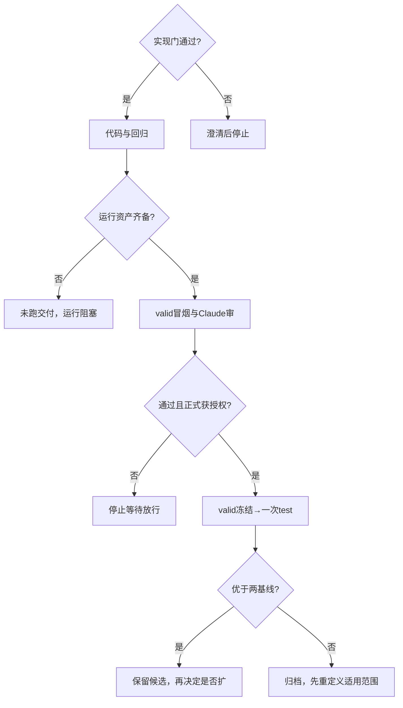

# NPJ-C 零训练改推理（1–5）研究计划

## 当前主线
- 保留：patient-fixed-padmask-v2，K=128；25个已有 E0/NPJ-C，compensator=none。
- 新协议：patient-fixed-padmask-v2-infer-rules1to5-v1。
- BLCA、BRCA、LGG、LUAD、UCEC × 123、132、213、231、321。
- none、rna_100、text_100、both_100 等权；none 是无额外人工遮挡，保留天然缺失。
- 固定参考为原 retrieval / m1 / m0real；不改变基线。
- 历史四场景检索0.628964、不补0.630751、均值0.631825仅为背景，不填写为新结果。
- 研究性质为历史test启发的探索性评测，不能称新盲测或证明检索机制。
- 全部新文件在本目录；不改公共源码、旧结果、缓存、权重、split；不训练、不commit/push。

## 主因链

| 固定目录/协议 | 锁定行为 |
|---|---|
| 01_text100_skip_compensate | text_100整个场景默认m0real，包括天然缺RNA；仅UCEC valid严格优于m0才允许检索 |
| 02_wsi_meanpool_key | WSI有效行均值1536维减train患者等权均值，余弦；不加入256维projector备选 |
| 03_shrinkage_lambda | μ + λ(donor−μ)，λ=[0,0.25,0.5,0.75,1]；双缺同donor、同λ |
| 04_wsi_rna_joint_sim | 仅text_100且本人RNA真实可用：WSI余弦 + α RNA余弦，α=[0.5,1,2]；RNA完整token投影前mean，不额外去中心 |
| 05_imputed_token_downweight | 新策略填入位置在最终pooling用w=[0.2,0.3,0.5]，本人可用=1；布尔attention mask不变，m1不改 |
| combo | 五规则联合；45组λ×α×w联合valid筛选 |

- 五单点各只开一条，其余保持原v2；未开②的单点保留原padmask展平，不是组合leave-one-out。
- 所有donor同癌train-only，排除自身。双缺同一同时拥有RNA/Text的donor；④候选必须RNA/Text都真实存在。
- 本人RNA不可用时④不生效；不使用填补RNA查询。空候选、非有限、形状错误、退化范数≤1e-12、非法padding均报错。
- 检索均值为每train患者有效行mean再患者等权平均；不随目标候选域改变。
- 原128行WSI前向mean仍含历史padding；去中心只作用检索副本。
- 均值/相似度/收缩float64，填值转回输入dtype；同分按patient ID排序最前。
- ⑤只改Transformer输出末端pooling分子/分母；没有新增参数，不保证消除attention中的填值影响。
- 单独③λ=0应等于m1；组合启用①或⑤时不再等价。

## 现在最该做
### 实验一：valid锁定
1. 固定三参考；58个新候选（1+1+5+3+3+45），逐个收齐100格。
2. ①和组合每个候选在UCEC/text_100五seed valid平均严格大于m0时启用例外；否则该格改用固定m0。其他四癌text_100始终m0。
3. 五癌五seed四场景等权；优先同时不低于m1/m0，再最大宏平均；无可行者最大平均Δ。
4. 原值完全平局依次小λ、小w、小α。未生效参数标注，不解释“最优”。
5. 存全部候选及选择依据，冻结参数、源码、配置、资产、环境指纹。缺格阻断、不删seed。

### 实验二：冻结test
- 六新协议各一次，与原retrieval/m1/m0同批；600新格+300固定参考记录。
- B风险为sigmoid→clamp[1e-6,1−1e-6]→cumprod survival→−sum；沿用原C-index实现。
- 故障恢复仅补缺失单元；配置和指纹一致；已完成单元禁止覆盖。
- 重放原retrieval与历史对照，不一致则报告不可直接比较，不改旧JSON。
- 正向保留探索候选；持平/更差完整归档停止，不加模块、参数、癌种或seed。

### 文档和实现
- 首文件precondition.md，分实现门/运行门。实现门全是才编码；运行门缺资产只阻断真实评测。
- 五目录各model.py（实际功能、中文备注）、config.yaml、分析核心修改.md。
- 根新增共享配置、推理入口、valid选择器、报告器、tests、证据与进度记录。
- 当前阶段只允许合成/回归、valid冒烟及Claude只读审；正式valid/test需另行放行。
- tako已有train/test与25权重；landau已有15份valid缓存。只复制既有资产至隔离运行区；逐文件SHA、内容、配对与split需重新核验。
- 核对GPU显存/进程/所有者；无闲卡不抢占，可运行CPU合成验证但不冒充GPU通过。

### 验收
- 原行为回归；mean-key置换不变且排padding；λ0/1端点；双缺同donor；场景/天然缺失边界。
- w1与原NPJC一致；mask与pool权重分开；权重及缓存不变。
- 完整患者logits atol=1e-6 rtol=0；检查0人时误差null。不同batch计数一致。
- 旧检索全测试和真实NPJC测试必须运行；没有torch不能用skip当通过。
- valid/test隔离、冻结防改、完整格点、失败不剔除；数字由同批结果生成。
- 全部报告6位小数；原值排序标红及计算Δ；绝对最佳与相对两基线增益最佳分别报告。
- 输出precondition.md、postcondition.md、零训练改推理1-5实验结果.md、seed单位-实验结果.md、癌症为单位.md。
- 保存逐患者预测、donor/分项相似度/候选数/原始缺失/实际路由/fusion mask/pool权重。
- 无结果填“未跑”，不编数；整轮postcondition未全通过时不得宣称整轮完成。

## 决策树

## 拍板
- 本轮先实现、回归、valid冒烟、Claude审核后回复；正式阶段锁住。
- 用户完整实施计划是本文件的上位约束。科学决策不由实现者临时更改。
