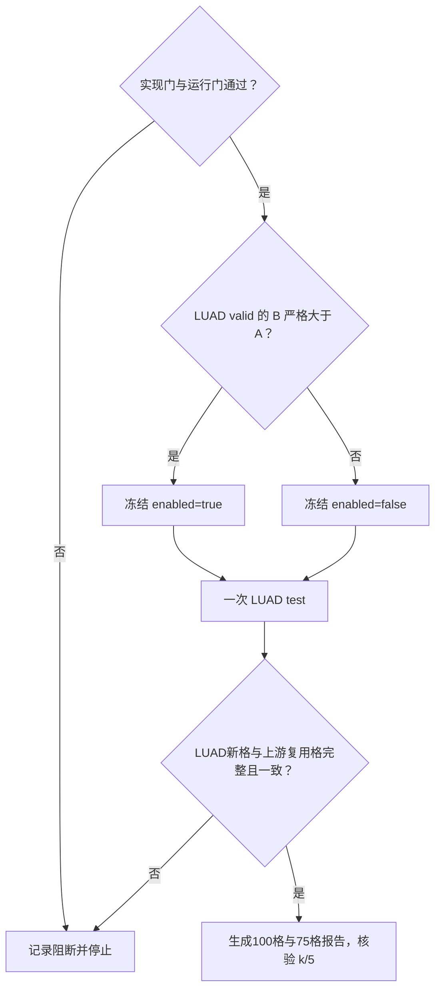

# strategy0：仅 LUAD 路由的零训练研究计划

| 项目 | 锁定内容 |
|---|---|
| 协议 | `patient-fixed-padmask-v2-infer-rules1to5-v1-luad-m1-v1`；上游 `combo-l1-a1-w0p5` |
| 唯一变量 | 仅 LUAD 按患者有效标记路由到上游组合、固定 `m1` 或固定 `m0real` |
| valid 冻结 | LUAD 五 seed×四场景等权：仅未舍入 B 严格大于 A 才启用；不搜 λ/α/w |
| test | LUAD 20 格单次前向；其余80格与300条固定参考按哈希复用上游 |
| 指标 | B 口径 C-index；主表100格等权，另报75格人工缺失；癌种胜=`组合>m1`且`组合>m0real` |

## 实现门

- [ ] `precondition.md`、上游哈希与本计划均先于推理代码存在。
- [ ] 路由单测覆盖 LUAD 四场景、四种天然缺失组合、非 LUAD 保持组合。
- [ ] m1/m0 路由与上游固定臂的填值、mask、pooling 逐元素对拍；完整输入 logits 使用 `atol=1e-6, rtol=0`。
- [ ] 新根目录所有源码、配置和测试与 `2.progress` 分离；`2.progress` 只读。

## 运行门

- [ ] 25权重、45缓存、标签、split、上游来源指纹核验通过。
- [ ] valid 只产生 LUAD A/B 的20格并落盘冻结文件；test 拒绝临时改变开关。
- [ ] Tak o 空卡门禁通过；无新训练、checkpoint、缓存或 split 写入。

## 决策树

## 停止规则

- valid 未启用时仍执行一次冻结 test；不根据 test 改路由。
- 不达到 `4/5` 时记录未胜癌种并停止；不改 BLCA 或新增策略。
