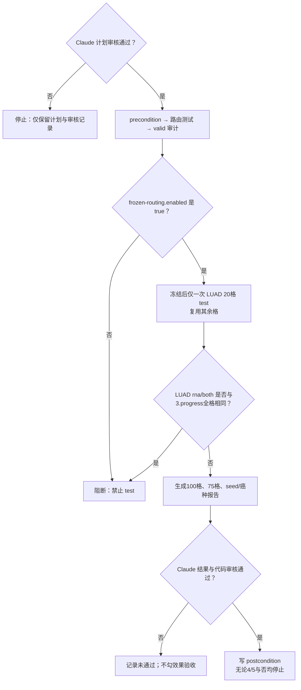

# S0-force：仅 LUAD 路由的零训练研究计划

## 当前主线

| 项 | 锁定内容 |
|---|---|
| 协议 | `patient-fixed-padmask-v2-infer-rules1to5-v1-luad-m1-force-v1` |
| 唯一变更 | 复用 `3.progress` 的 LUAD 路由表，但废除 `B > A` 否决，冻结 `strategy0_enabled=true`。 |
| 固定资产 | 五癌×五 seed、25 个 E0/NPJ-C checkpoint、K=128、缓存、split、B 口径均不变。 |
| 上游只读 | `2.progress` 组合 `combo-l1-a1-w0p5`（指纹 `32cb3f31579bec549214d8577ac3fe057edb84b8a3fac49989c7e86090c94f14`）；`3.progress` 仅作对照，均禁止改写。 |
| 已知反证 | `3.progress` valid：A=0.654042、B=0.645226、B−A=−0.008815；本轮仍强制开，因此是 test 泄漏的探索性反事实，不是盲测。 |
| 主／次指标 | 五癌×五 seed×四场景共 100 格等权 B 口径 C-index／严格超过 m1 与 m0real 的癌种数 `k/5`。另报排除 `none` 的 75 格。 |
| 停止边界 | 只允许翻 LUAD；BLCA、λ、α、w、seed、训练与网络均不改。 |

**总体判定：**本轮只检验“将 LUAD 的 RNA 向检索格改为固定 m1，是否使 LUAD 严格超过两基线”。即使达到 4/5，也只能归因于**少检索、改走 m1**，不能写成患者检索机制成立。

## 主因链

## 现在最该做

| 实验卡 | 内容 |
|---|---|
| 目的 | 在不重训、不重搜参数的条件下，验证强制 LUAD 路由对 LUAD 四场景均分及五癌 `k/5` 的影响。 |
| 范围 | valid 仅审计 LUAD 20 格 A/B；冻结后 test 仅新算 LUAD 20 格。非 LUAD 80 格与固定 m1/m0 逐格复用 `2.progress`。 |
| 路由 | `text_100` 固定 m0real；`rna_100` 与 `both_100` 固定 m1；`none` 的天然缺 RNA／双缺固定 m1；`none` 仅缺 Text 与无缺失保持冻结组合。 |
| 若 LUAD 严格胜两基线 | 报告五癌胜率，保留为“强制路由的探索性反事实”；停止，不扩癌种或 seed。 |
| 若持平或更差 | 如实报告 LUAD 和总表，停止；不改 BLCA、λ、seed 或训练。 |

### 冻结与一致性规则

| 项 | 要求 |
|---|---|
| valid | 保留 A/B 与 B−A 审计；允许复用 `3.progress` 的 valid B，前提是来源和哈希一致。valid 不再拥有关闭开关的权力。 |
| frozen-routing | `enabled` 必须是 JSON 布尔值 `true`；`decision_rule` 写明“`S0-force强制启用；valid仅审计`”。 |
| test | 只执行一次冻结后的 LUAD 20 格；禁止复用 `3.progress` 的 LUAD test，因为其全部为 `enabled=false`。 |
| 路由等价 | LUAD 的 m1 路由必须直接走固定 m1 路径，填值、mask、pooling 均等价于 m1（`w=1`，无残留 `λ=1/w=0.5`）。`text_100` 必须等价于 m0real。 |
| 上游复用 | 固定 m1、m0real、非 LUAD 组合必须与 `2.progress` 原始逐格数值 IDENTICAL；任何差异阻断合表。 |
| 生效检验 | LUAD 的 `rna_100` 与 `both_100` 新 test C-index 不得与 `3.progress` 同格全部 IDENTICAL；若全部相同，视为路由未生效并阻断。 |

## 决策树

## 拍板

| 卡 | 动作 |
|---|---|
| 已锁定 | 强制启用 `enabled=true`；valid 仅作为泄漏审计，不得重新否决。 |
| 禁止 | 不改 BLCA、不重搜 λ/α/w、不训练、不扩 seed。 |
| 下一门 | Claude 只读审核本计划；通过后才创建 `precondition.md`、代码与运行产物。 |

