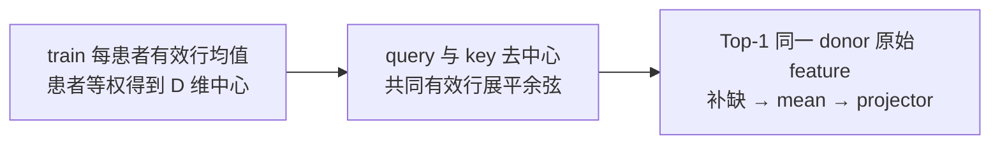
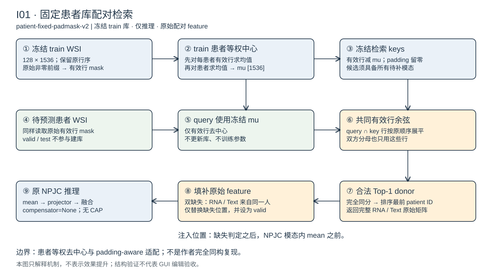

# I01 机制：patient-fixed-padmask-v2

[确定] 以下机制来自已读取的固定库、评测入口与 `NPJC.forward` 源码；本次没有重跑历史实验。代码来源见 [知识索引](index.md)。

## 定位与数据

这是患者级 Top-1 配对检索，使用冻结的 train WSI 缓存，不训练检索库。当前来源实现的输入为 WSI `[128,1536]`、RNA `[2048,256]`、Text `[200,768]`；WSI 行顺序保持原缓存顺序，代码不重新聚类或匹配/排列各行。

train/valid/test ID 必须唯一且互不相交。仅 train 入库，候选 donor 还必须真实具备当前待补模态；双缺失时 RNA 与 Text 必须由同一个两者均可用的 donor 提供，不要求所有入库患者全模态完整。候选排除 query 自身。

## 三步主因链



### 1. 有效行与患者等权中心

`valid_row_mask` 在去中心之前从原始 WSI 判定：非零行必须为连续前缀，全零行为补齐后缀，空有效集与中间出现零行均报错。设患者 p 的有效行集合为 Vp：

```text
u_p = mean(X_p[r, :], r ∈ Vp)
mu  = mean(u_p, p ∈ train)
Z_p[r, :] = X_p[r, :] - mu   （r ∈ Vp）
Z_p[r, :] = 0               （padding 行）
```

每个 train 患者等权，不按其有效行数加权。query 使用同一个冻结 `mu`；valid/test 不参与中心估计。

### 2. 共同有效行余弦与确定性 Top-1

对 query q 与候选 p，只取 `Vq ∩ Vp` 对应行，保持行序后展平为向量，再计算余弦。分子与双方分母均只使用共同有效行；不是先按各自全部有效行归一化后再裁剪。使用 float64 累加，空交集、非有限数或范数不大于 `1e-12` 均报错。

候选按 patient ID 排序；相似度完全相同则 `argmax` 取排序后最前者。每个 pair 独立求和，避免改变 query batch 导致矩阵乘法舍入改变 Top-1。查找缓存包含协议、bank fingerprint、query split/ID、缺失集合与 query 内容哈希，不缓存投影后特征。

### 3. 原始配对特征补缺与融合

`FixedPatientBank.compensate → prepare_batch` 将 donor 的完整 RNA/Text 原始 feature 复制到缺失位置，并将被补位置设为 valid；原本可用的模态保持不变。双缺失不会分别找两个 donor，也不传回单个 WSI 中心对应的片段。

**准确注入位置**：批数据缺失判定之后，进入 `NPJC.forward` 的模态内 `mean(dim=1)` 之前。

```text
原始模态与 valid
  → 缺失位置替换为 donor 完整原始 feature
  → NPJC 模态内 mean
  → 原有 m_projector
  → 原有融合与风险输出
```

检索 padding mask 只规定检索签名与相似度口径；本试点不改写 NPJC 原有 mean 池化。模型构造直接 `compensator=None`，不实例化 CAP，不新增 projector、对齐损失或可训练检索参数。推理使用 `eval()` 与 `inference_mode()`，严格加载既有骨干权重。

## 三臂关系与证据边界

- `m0real`：不填补，保留真实缺失掩码。
- `m1`：按模态使用真实可用 train 患者的原始 feature 均值填缺。
- `retrieval`：按上述 WSI 相似度选一个合法 donor 填缺。

该适配有患者等权去中心、共同有效行 padding 处理与无 CAP NPJC 路线，**不是作者完全同构复现**；也不是可学习原型或簇级人群配对原型。这里说明如何运算，不声称检索效果优于均值，不引入旧笔记中的动态 dropout 训练。

## 实现与图

新算法入口见 [model.py](../model.py) 的文字标记 `# [创新 I01-01]`。回归证据与历史评测分开记录于 [结果索引](../results/index.md)。



[原始 Excalidraw 场景](method.excalidraw) 与 SVG 内嵌场景采用同一份数据；结构核验结果见 [diagram-validation.md](diagram-validation.md)。结构检查不代表 GUI 打开、编辑与保存已通过。
