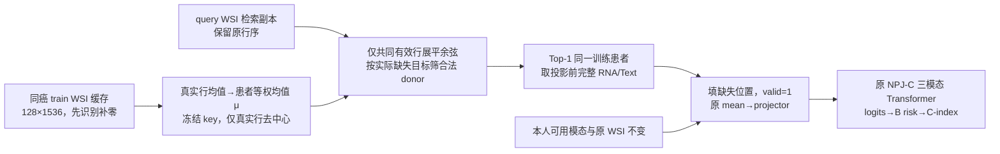
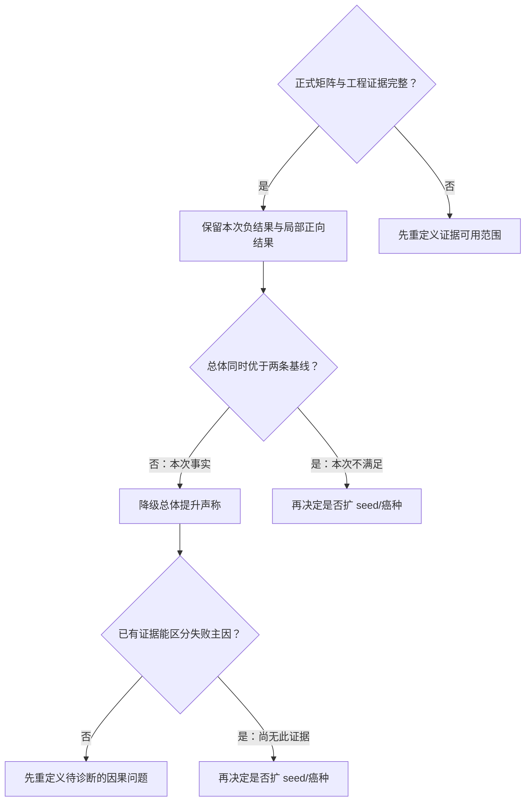

# patient-fixed-padmask-v2｜总实验 map

> 整理日期：2026-09-16。对象唯一锁定为 **patient-fixed-padmask-v2，K=128**。此前 Q2 中的 K=8 是笔误，不是本实验配置；不混入 I02 population-K8。
>
> 结论：正式结果完整，工程核验有留档；当前固定患者检索在总体 B 口径 C-index 上未优于均值填补及不补偿。**这是具体零训练协议的负结果，不是所有患者检索方法的否定。**

## 1. 背景与待解决问题

### 背景

TCGA 患者并不都同时具有 WSI、RNA、Text。已有无 CAP 的 NPJ-C/E0 生存模型在缺失模态时可屏蔽该模态；另一朴素方案是用同癌种训练集的平均特征填补。患者级检索试图根据现有 WSI 找到相似的训练患者，借用其配对 RNA/Text，提供比平均特征更有针对性的信息。

### 研究问题

**同一无 CAP 的 NPJ-C 权重下，仅改变推理期缺失填补策略，患者 Top-1 检索能否比训练集均值填补与不补偿提高 B 口径 C-index？**

不是检验“新增训练的原型模型是否有效”，不是跨癌泛化实验，也不是评估 CAP。未新增训练、没有对齐损失、没有可学习患者库，未重新选 checkpoint。

### 方法类别与候选贡献

- 方法类别：**非参数、固定库、患者内原型引导的患者级配对检索补偿**。
- 患者内 WSI 原型用于选患者；补回的是该患者投影前的完整目标模态缓存特征，不是 WSI 原型向量。
- 来源脉络是 M³Surv 的患者级配对检索思路；本次实现经过冻结 key、去中心、补零排除与 NPJ-C 接口适配。**不声称完整复现 M³Surv，也不声称逐行等同作者代码。**
- 边界锁定：K=128；K=8是此前Q2笔误；max_epochs=200、patience=15属于未来方案，不属于本轮零训练评测或历史E0训练。

本轮核实的是本仓正式运行源码；没有重新核验 M³Surv 第三方仓库，论文/作者代码对齐程度不作为本报告已核实事实。
- “原型学习已提升生存预测”不成立：患者库没有可学习量，总体收益也未出现。

## 2. 已有数据与实验范围

| 项目 | 实际采用 |
| --- | --- |
| 癌种 | BLCA、BRCA、LGG、LUAD、UCEC；不包含 GBM、COAD、READ、HNSC、STAD，不合并成 GBMLGG |
| Seeds | 123、132、213、231、321 |
| 权重 | 25 份历史 E0/NPJ-C、无 CAP；每癌每 seed 三臂共用同一份 checkpoint |
| 评测臂 | retrieval、m1（训练集均值）、m0real（不补偿） |
| 场景 | none、rna_100、text_100、both_100 |
| 规模 | 25 checkpoint × 3 臂 × 4 场景 = 300 个 C-index，100 组三臂比较 |
| 排名范围 | 按用户最终要求，**none 参与总体排名**；另外单列原三人工缺失场景，保留旧口径可比性 |
| 缺失含义 | none = 无额外人工遮挡，仍保留天然缺失；天然缺失按三臂各自规则处理 |
| 共同控制 | 同一患者划分、权重、输入患者、manifest、模型配置、风险计算；不根据 test 调 K 或相似度 |

每癌种五个 seed 使用同一患者划分；seed 主要区分历史训练权重，不构成五个独立患者队列。总体按癌种×seed×场景等权，不按患者数加权，也不是把不同癌患者混在一起算一个 C-index。

### 数据形状与适配条件

| 特征 | 投影前缓存形状/患者 | 原 NPJ-C 的消费 |
| --- | --- | --- |
| WSI | 128×1536 | 对原 128 行 mean → Linear(1536,256) → ReLU → Dropout |
| RNA | 2048×256 | 对 2048 行 mean → Linear(256,256) → ReLU → Dropout |
| Text | 200×768 | 对 200 行 mean → Linear(768,256) → ReLU → Dropout |

这里的“原始 RNA/Text”仅指 **projector 之前的缓存特征**，不是未经处理的测序数据或原文字符串。

WSI 缓存生成路径在 [tcga_dataset.py](/Users/wuhao/Desktop/TriModalSurv/archive/legacy_npj_snapshot/774f-6a04a0bf5c28/code/NPJ/loc_utils_3yr/tcga_dataset.py:378)：拼接患者 patch；patch 不少于128时 MiniBatchKMeans(n_clusters=128, random_state=42)，否则保留原 patch 并尾部补零。因此 K=128 表示固定缓存行数，**不保证每患者都有128个真实聚类中心**。该数据生成文件用于解释历史缓存实现，本轮正式四文件指纹清单不包含它。

Transformer 实际融合序列是 **3×256（WSI、Text、RNA 各一个 token）**，不是128个WSI token直接进入融合。因此本报告不沿用“改变K必然使全部checkpoint strict_load失败”的旧推断；本轮仍遵守K=128锁定，不改变模型输入协议。

### 患者及候选人数

| 癌种 | train / valid / test | test 天然缺 RNA / Text / 双缺 | RNA / Text / 双目标候选 | none 完整输入核验人数/seed |
| --- | --- | --- | --- | --- |
| BLCA | 136 / 68 / 138 | 0 / 0 / 0 | 134 / 136 / 134 | 138 |
| BRCA | 383 / 192 / 383 | 1 / 36 / 1 | 383 / 352 / 352 | 347 |
| LGG | 166 / 83 / 166 | 0 / 3 / 0 | 166 / 162 / 162 | 163 |
| LUAD | 171 / 84 / 172 | 0 / 5 / 0 | 167 / 165 / 165 | 167 |
| UCEC | 197 / 99 / 198 | 1 / 8 / 0 | 195 / 188 / 187 | 189 |

天然缺失表的前两列为各模态缺失总数，**已包含双缺患者**；第三列是二者交集，不应再次相加。

候选域按每位 query 的**实际缺失模态集合**过滤；例如 rna_100 的患者若天然缺 Text，应使用双目标候选域，不能一概套 RNA 候选人数。

适配成立的工程条件：每癌 train 中存在合法 donor，目标缓存形状一致、WSI可用、患者配对与split可核对。该条件不等于“形态相似必然意味着RNA/Text或生存风险相似”。适用范围仅覆盖这五癌、这些缓存与本次缺失协议，不外推到未知癌种或所有真实临床缺失机制。

## 3. 实际配置与超参数

以下是**从正式执行器常量、命令与 preflight 重建的运行配置摘要**，不是伪称当时有一份完整中心化 YAML。后来重构的 [I01 config.yaml](/Users/wuhao/Desktop/TriModalSurv/experiments/I01_patient_retrieval/results/../config.yaml) 仅作当前入口导航，不证明2026-09-15正式实验读取过该文件。

```yaml
protocol_id: patient-fixed-padmask-v2
cancers: [BLCA, BRCA, LGG, LUAD, UCEC]
seeds: [123, 132, 213, 231, 321]
arms: [retrieval, m1, m0real]
grids: [none, rna_100, text_100, both_100]
training_this_experiment: false
model:
  network_type: NPJC
  compensator: none
  hidden_size: 256
  pred_dim: 4
  n_backbone: 1
  n_head: 4
  mlp_ratio: 4
  dropout_rate: 0.1
  modality_order: [img, text, rna]
retrieval:
  prototype_k: 128
  top_k_patient: 1
  key: frozen_WSI_cache
  value: pre_projector_full_feature
  centering: train_patient_equal_valid_row_mean
  similarity: original_order_common_valid_rows_cosine
  refresh: none
  ema: none
  self_retrieval: excluded
  tie_break: lexicographically_first_patient_id
  min_centered_norm_exclusive: 1.0e-12
evaluation:
  metric: cindex_B
  batch_size: 32
  device: cuda
  forward_dtype: float32
  bank_statistics_and_similarity_dtype: float64
  model_mode: eval
  gradient: disabled
  complete_logit_atol: 1.0e-6
  complete_logit_rtol: 0
  torch_threads: 4
```

填补值回转输入 dtype；原缓存不变。eval() 下 Dropout 关闭。执行器构造模型时的随机初始化随后被 strict checkpoint 完整覆盖，不把构造用 seed=0 当成实验训练 seed。

新患者库无 loss、optimizer、学习率、训练轮数或早停参数；这些只属于历史底座训练。不存在本轮“检索损失权重”。

## 4. 执行逻辑与选择理由



### 4.1 固定库与 padmask 的精确定义

设患者 i 的原 WSI 矩阵为 X_i，M_ij 表示第 j 行不是全零，n_i 为真实行数。先识别补零，再计算：

```text
μ = (1 / |train|) Σ_i [(1 / n_i) Σ_{j:M_ij=1} X_ij]
Z_ij = X_ij − μ    当 M_ij=1
Z_ij = 0          当 M_ij=0

J(q,i) = {j : M_qj=1 且 M_ij=1}
score(q,i) =
  <vec(Z_q[J]), vec(Z_i[J])> /
  (||vec(Z_q[J])|| × ||vec(Z_i[J])||)
```

- μ 只来自对应癌 train；所有 train 患者的 WSI 参与μ，目标模态缺失只影响该目标 donor 候选资格。
- 同一对 query/donor，余弦分子和**双方分母**都只使用共同有效行；不是把padding减μ后参与相似度。
- 保留各缓存原行序；没有跨患者中心对齐、排序、集合匹配、重复填充或重新聚类。它仍是对排列敏感的固定位置比较，padmask只排除补零贡献，不解决中心语义对应问题。
- BLCA test 1位患者123真实行；LGG train 2位分别124/75真实行，test 1位96真实行。LGG train均值因此可能影响全癌查询，不能说影响局限于4位患者。
- 检索副本与模型输入隔离：模型仍按原128行求WSI均值，包括历史补零；不在本轮偷偷改为真实行pooling。
- 固定库与模型权重无关，训练前或后构造都可；“建库一次”指内容不随训练更新。预检与正式进程可重复构造相同内容，不表示构造函数只能被调用一次。

### 4.2 三臂接口

| 臂 | 缺失位置的 value | 融合 valid | 对照含义 |
| --- | --- | --- | --- |
| m0real | 保留全零占位特征 | false，屏蔽 | 不补偿 |
| m1 | 同癌 train 中真实拥有该目标者的逐元素均值 | true | 不依赖 query 的盲补 |
| retrieval | 合法 Top-1 donor 的完整目标缓存特征 | true | WSI 条件患者选择 |

所有可用的本人模态保留；单缺取相应目标，双缺由**同一个同时具备RNA和Text的donor**提供。均值填补两个目标可以来自不同的可用患者集合。

valid=true 仅表示允许进入融合，不是模型显式输出“置信度=1”。retrieval 与 m1 的比较更直接检查“个体化选值是否优于盲补”；与 m0real 的比较还包含开启目标模态融合及pooling分母变化，不能将差异全部归因于donor好坏。

### 4.3 当时的选择理由，不是事后收益证明

| 选择 | 控制目的 | 保留的风险 |
| --- | --- | --- |
| 零训练、同一E0三臂 | 隔离推理换填的增量，避免新训练成本和混杂 | 底座未针对借来的特征适配 |
| 冻结WSI key、原始value现投影 | 不引入跨轮漂移或EMA中心对应问题 | WSI几何不一定对应目标模态/生存信息 |
| K=128与原行序 | 复用已有缓存，固定本轮协议 | 独立K-means中心行号没有跨患者语义保证 |
| 去中心与padmask | 降低共享偏移，排除补零伪相似度 | 不保证检索排序就有生物意义 |
| Top-1同donor | 简单、可追溯，双缺保持donor内部配对 | 单个donor方差；query与donor仍非本人配对 |
| 无CAP与新对齐参数 | 保留原NPJC；本轮只评填补 | 不能学会专门筛选或消化外来特征 |

这些工程选择适配了现有数据接口，但实际结果不支持把“接口适配”写成“科研有效”。

## 5. 核心代码与来源

正式 preflight 记录的四份源码 SHA256 与本轮读取的本地文件一致。下方链接改指项目内归档快照 774f-6a04a0bf5c28（目录标识），四个文件已与正式指纹及原工作树逐字节核对；历史命令/日志/训练重建源码也已与 archive/legacy_collab 对应副本核对。链接不再依赖临时工作树存活：

- [model/patient_retrieval_bank.py](/Users/wuhao/Desktop/TriModalSurv/archive/legacy_npj_snapshot/774f-6a04a0bf5c28/code/NPJ/model/patient_retrieval_bank.py)：`1a87fd04dc4ec87591421b76424aba60b0bb523a6849eae2dcc5a6b921663bb0`
- [model/fusion_model.py](/Users/wuhao/Desktop/TriModalSurv/archive/legacy_npj_snapshot/774f-6a04a0bf5c28/code/NPJ/model/fusion_model.py)：`03c4060232d2d18ca277205e5a3dc47a8e3617e930128c839b11402953a7a096`
- [scripts/eval_missing.py](/Users/wuhao/Desktop/TriModalSurv/archive/legacy_npj_snapshot/774f-6a04a0bf5c28/code/NPJ/scripts/eval_missing.py)：`e42d52c3a87e34ba77d293c61131046cff6bdeadf703c74dde3d2cf59f98ef93`
- [scripts/eval_patient_retrieval.py](/Users/wuhao/Desktop/TriModalSurv/archive/legacy_npj_snapshot/774f-6a04a0bf5c28/code/NPJ/scripts/eval_patient_retrieval.py)：`76cf8f3e58703c4615910e8cc3457a6539e9feefc27dc937239ae89a57a334de`

### 补零识别与共同有效行余弦

来源：[model/patient_retrieval_bank.py，47–81 行](/Users/wuhao/Desktop/TriModalSurv/archive/legacy_npj_snapshot/774f-6a04a0bf5c28/code/NPJ/model/patient_retrieval_bank.py:47)；以下为源文件原文节选，不是完整可独立运行的脚本。

```python
def valid_row_mask(wsi, *, context, shape=None):
    """仅接受旧缓存的非零前缀+补零后缀；在去中心之前取 mask。"""
    array = _numeric(wsi, context=context, shape=shape)
    if array.ndim != 2 or array.shape[0] != 128:
        raise ValueError(f'{context}: expected 128 WSI rows')
    mask = ~np.all(array == 0, axis=1)
    count = int(np.count_nonzero(mask))
    if count == 0 or not np.array_equal(mask, np.arange(128) < count):
        raise ValueError(f'{context}: invalid zero/padding layout (need nonzero prefix)')
    mask.setflags(write=False)
    return mask


def masked_cosine(query, key, query_mask, key_mask):
    """固定行序，仅共同有效行进入分子和双方分母。"""
    q = _numeric(query, context='centered query')
    k = _numeric(key, context='centered key', shape=q.shape)
    if q.ndim != 2:
        raise ValueError('centered WSI must be a matrix')
    qm, km = np.asarray(query_mask), np.asarray(key_mask)
    if any(m.dtype != np.bool_ or m.shape != (q.shape[0],) for m in (qm, km)):
        raise ValueError('invalid row mask shape/dtype')
    common = qm & km
    if not common.any():
        raise ValueError('empty valid-row overlap')
    qv = q[common].astype(np.float64, copy=False).reshape(-1)
    kv = k[common].astype(np.float64, copy=False).reshape(-1)
    qnorm, knorm = np.linalg.norm(qv), np.linalg.norm(kv)
    if any(not np.isfinite(n) or n <= 1e-12 for n in (qnorm, knorm)):
        raise ValueError('invalid common-row centered norm')
    score = float(np.sum(qv * kv, dtype=np.float64) / (qnorm * knorm))
    if not np.isfinite(score):
        raise ValueError('nonfinite masked cosine')
    return score
```

### 患者等权去中心均值与目标模态均值

来源：[model/patient_retrieval_bank.py，116–130 行](/Users/wuhao/Desktop/TriModalSurv/archive/legacy_npj_snapshot/774f-6a04a0bf5c28/code/NPJ/model/patient_retrieval_bank.py:116)；以下为源文件原文节选，不是完整可独立运行的脚本。

```python
        self.row_masks = np.stack([row_masks[pid] for pid in self.patient_ids])
        self.row_masks.setflags(write=False)
        self.valid_row_counts = {pid: int(row_masks[pid].sum()) for pid in self.patient_ids}
        self.mean = np.mean([self._features['img'][pid][row_masks[pid]].mean(axis=0, dtype=np.float64)
                             for pid in self.patient_ids], axis=0, dtype=np.float64)
        self.mean.setflags(write=False)
        self.keys = np.stack([self._signature(self._features['img'][pid], pid)[0]
                              for pid in self.patient_ids])
        self.keys.setflags(write=False)
        self.means = {}
        for mm in MODALITIES:
            total = np.zeros(self.shapes[mm], dtype=np.float64)
            for value in self._features[mm].values():
                total += value
            total /= len(self._features[mm])
```

### 候选过滤、Top-1 与同 donor 取值

来源：[model/patient_retrieval_bank.py，154–178 行](/Users/wuhao/Desktop/TriModalSurv/archive/legacy_npj_snapshot/774f-6a04a0bf5c28/code/NPJ/model/patient_retrieval_bank.py:154)；以下为源文件原文节选，不是完整可独立运行的脚本。

```python

    def retrieve(self, patient_id, wsi, missing_modalities, *, query_split='test'):
        missing = tuple(mm for mm in MODALITIES if mm in missing_modalities)
        if not missing or set(missing_modalities) != set(missing):
            raise ValueError('retrieval requires rna and/or text')
        signature, mask = self.validate_query(patient_id, wsi, query_split)
        query_hash = hashlib.sha256(signature.tobytes() + mask.tobytes()).hexdigest()
        cache_key = (PROTOCOL_ID, self.fingerprint, query_split, patient_id, missing, query_hash)
        if cache_key not in self._lookup:
            candidates = [i for i, pid in enumerate(self.patient_ids)
                          if pid != patient_id and all(pid in self._features[mm] for mm in missing)]
            if not candidates:
                raise ValueError(f'{patient_id}: empty candidate set for {missing}')
            # 每个 pair 独立按固定维度求和，避免 query batch 改变 GEMM 舍入及 Top-1。
            scores = [masked_cosine(signature, self.keys[i], mask, self.row_masks[i]) for i in candidates]
            selected = int(np.argmax(scores))  # patient_ids 已排序，完全并列取最前。
            index = candidates[selected]
            self._lookup[cache_key] = (self.patient_ids[index], scores[selected], len(candidates),
                                      int(np.count_nonzero(mask & self.row_masks[index])))
        donor, score, count, common_count = self._lookup[cache_key]
        return {'donor_id': donor, 'similarity': score, 'candidate_count': count,
                'query_valid_rows': int(mask.sum()), 'donor_valid_rows': self.valid_row_counts[donor],
                'common_valid_rows': common_count, 'padding_strategy': PADDING_STRATEGY,
                'values': {mm: self._features[mm][donor].copy() for mm in missing}}
```

### 原始批次：天然缺失、人工遮挡与全零占位

来源：[scripts/eval_patient_retrieval.py，120–133 行](/Users/wuhao/Desktop/TriModalSurv/archive/legacy_npj_snapshot/774f-6a04a0bf5c28/code/NPJ/scripts/eval_patient_retrieval.py:120)；以下为源文件原文节选，不是完整可独立运行的脚本。

```python
    def batch(self, ids, grid):
        if grid not in GRIDS or len(ids) != len(set(ids)) or not set(ids).issubset(self.ids):
            raise ValueError('非法 grid 或 batch 患者')
        raw = {'img': np.stack([self.features['img'][pid] for pid in ids]),
               'img_valid': np.ones(len(ids), dtype=bool)}
        natural = {}
        for mm in ('rna', 'text'):
            natural[mm] = np.array([self.features[mm].get(pid) is not None for pid in ids])
            valid = natural[mm] & (mm not in masked_modalities(grid))
            raw[mm + '_valid'] = valid
            raw[mm] = np.stack([np.asarray(self.features[mm][pid], dtype=np.float32) if valid[i]
                               else np.zeros(self.bank.shapes[mm], dtype=np.float32)
                               for i, pid in enumerate(ids)])
        return raw, natural
```

### 三臂补偿分叉：仅写入缺失位置

来源：[model/patient_retrieval_bank.py，179–215 行](/Users/wuhao/Desktop/TriModalSurv/archive/legacy_npj_snapshot/774f-6a04a0bf5c28/code/NPJ/model/patient_retrieval_bank.py:179)；以下为源文件原文节选，不是完整可独立运行的脚本。

```python
    def compensate(self, patient_ids, wsi, values, valids, arm, *, query_split='test'):
        if arm not in ('m0real', 'm1', 'retrieval'):
            raise ValueError(f'unknown arm: {arm}')
        ids = list(patient_ids)
        if len(ids) != len(set(ids)) or len(wsi) != len(ids):
            raise ValueError('duplicate patient ID or batch size mismatch')
        output, masks = {}, {}
        for mm in MODALITIES:
            array = np.asarray(values[mm])
            if array.shape != (len(ids), *self.shapes[mm]) or not np.isfinite(array).all():
                raise ValueError(f'{mm}: invalid batch feature shape or values')
            mask = np.asarray(valids[mm])
            if mask.shape != (len(ids),) or not np.isin(mask, [0, 1]).all():
                raise ValueError(f'{mm}: invalid valid mask')
            output[mm] = array.copy()
            masks[mm] = mask.astype(bool, copy=True)
        records = []
        for row, pid in enumerate(ids):
            _, row_mask = self.validate_query(pid, wsi[row], query_split)
            missing = tuple(mm for mm in MODALITIES if not masks[mm][row])
            record = {'patient_id': pid, 'original_valid': {mm: bool(masks[mm][row]) for mm in MODALITIES},
                      'donor_id': None, 'similarity': None, 'candidate_count': 0,
                      'query_valid_rows': int(row_mask.sum()), 'donor_valid_rows': None,
                      'common_valid_rows': None, 'padding_strategy': PADDING_STRATEGY}
            if missing and arm == 'retrieval':
                selected = self.retrieve(pid, wsi[row], missing, query_split=query_split)
                for mm in missing:
                    output[mm][row] = selected['values'][mm]
                    masks[mm][row] = True
                record.update({k: selected[k] for k in ('donor_id', 'similarity', 'candidate_count',
                                                       'donor_valid_rows', 'common_valid_rows')})
            elif missing and arm == 'm1':
                for mm in missing:
                    output[mm][row] = self.means[mm]
                    masks[mm][row] = True
            records.append(record)
        return output, masks, records
```

### 原 mean → projector 与 valid 标记

来源：[model/fusion_model.py，1140–1158 行](/Users/wuhao/Desktop/TriModalSurv/archive/legacy_npj_snapshot/774f-6a04a0bf5c28/code/NPJ/model/fusion_model.py:1140)；以下为源文件原文节选，不是完整可独立运行的脚本。

```python
        tokens = {}
        valids = {}
        for mm in self.m_projector.keys():
            x = all_modalities[mm]
            if x.dim() == 3:
                x = x.mean(dim=1)
            tokens[mm] = self.m_projector[mm](x)

            batch_size = tokens[mm].shape[0]
            if mm == 'img':
                valid = torch.ones(batch_size, device=tokens[mm].device)
            else:
                valid = all_modalities.get(
                    f"{mm}_valid",
                    torch.ones(batch_size, device=tokens[mm].device),
                )
            valids[mm] = torch.as_tensor(
                valid, device=tokens[mm].device
            ).reshape(batch_size).bool()
```

随后省略的 fusion_model.py 1160–1191 行是 compensator 分支，本轮 compensator=None，不进入；接着执行下面的融合代码。

### 三模态 token 融合与 valid mask

来源：[model/fusion_model.py，1193–1203 行](/Users/wuhao/Desktop/TriModalSurv/archive/legacy_npj_snapshot/774f-6a04a0bf5c28/code/NPJ/model/fusion_model.py:1193)；以下为源文件原文节选，不是完整可独立运行的脚本。

```python
        seq = torch.stack(
            [tokens[mm] for mm in self.modalities], dim=1
        ) + self.modality_embed
        valid = torch.stack(
            [valids[mm] for mm in self.modalities], dim=1
        )
        h = self.backbone(seq, src_key_padding_mask=~valid)
        valid_weight = valid.unsqueeze(-1).to(dtype=h.dtype)
        pooled = (h * valid_weight).sum(dim=1) / valid_weight.sum(
            dim=1
        ).clamp_min(1.0)
```

### B 口径风险变换

来源：[scripts/eval_missing.py，138–147 行](/Users/wuhao/Desktop/TriModalSurv/archive/legacy_npj_snapshot/774f-6a04a0bf5c28/code/NPJ/scripts/eval_missing.py:138)；以下为源文件原文节选，不是完整可独立运行的脚本。

```python
def dual_risk_from_logits(logits):
    """复现 A=raw cumprod 与 B=sigmoid+clamp cumprod 两种风险。"""
    import torch

    if not torch.is_tensor(logits) or logits.ndim != 2:
        raise ValueError("logits 必须是二维 torch.Tensor")
    risk_a = -torch.sum(torch.cumprod(1.0 - logits, dim=1), dim=1)
    hazards_b = torch.clamp(torch.sigmoid(logits), 1e-6, 1.0 - 1e-6)
    risk_b = -torch.sum(torch.cumprod(1.0 - hazards_b, dim=1), dim=1)
    return risk_a, risk_b
```


补充入口：[eval_patient_retrieval.py](/Users/wuhao/Desktop/TriModalSurv/archive/legacy_npj_snapshot/774f-6a04a0bf5c28/code/NPJ/scripts/eval_patient_retrieval.py) 完成缓存加载、strict E0加载、三臂prepare_batch、eval/inference_mode、B风险、完整输入logits检查、预测/audit存盘。检索填补发生在调用模型前，不在Transformer中新增模块。

## 6. 历史底座训练策略：不要与本次评测或未来计划混用

| 项目 | 可核对内容 | 证据强度 |
| --- | --- | --- |
| 癌种/seed/网络 | 五癌×五seed，NPJC，无CAP | 历史命令和25段日志直接记录 |
| epochs / batch / lr / K | 50 / 32 / 1e-4 / 128 | 命令与25段日志一致 |
| 实际完成轮数 | 每份均50轮，25/25完成 | 按原日志 train/valid tqdm 成对启动重建 |
| 早停 | 未见早停；日志支持跑满50轮 | 修复前源码无patience/early-stop分支，结合日志 |
| 人工训练模态dropout | 0；天然缺失仍可能存在 | 历史参数记录；不能写训练只见完整患者 |
| Adam / weight decay / AMP | Adam、weight_decay=1、bf16 | **9月15日冻结源码重建，不是训练时源码指纹或日志明示** |
| Loss | NLLSurvLoss(alpha=0, eps=1e-7)，无检索/对比损失 | 同上，源码重建；E0不执行CAP一致性分支 |
| 模型Dropout | 有效路径默认0.1，而非配置文件表面0.2 | 同上，load_model调用未传dropout参数 |
| 最佳权重选择 | valid指标严格改善即保存；冻结源码路径为A风险 | 同上；不声称有训练时完整代码快照 |
| 本轮结果风险 | B：sigmoid(logits)→clamp→cumprod survival→负和risk | 正式评测源码指纹与结果证据直接支持 |

历史命令：[c_unit.sh](/Users/wuhao/Desktop/TriModalSurv/archive/legacy_collab/source-774f/20260915-M3Surv-fixed-bank/formal-preflight/provenance/scripts/c_unit.sh:10)。
源码重建：[main_survival.py](/Users/wuhao/Desktop/TriModalSurv/archive/legacy_collab/source-774f/20260915-M3Surv-fixed-bank/repair-r2/source-before/main_survival.py:665)。
分别定位：[Adam/weight decay/AMP](/Users/wuhao/Desktop/TriModalSurv/archive/legacy_collab/source-774f/20260915-M3Surv-fixed-bank/repair-r2/source-before/main_survival.py:717)、[固定轮数循环](/Users/wuhao/Desktop/TriModalSurv/archive/legacy_collab/source-774f/20260915-M3Surv-fixed-bank/repair-r2/source-before/main_survival.py:731)、[valid风险计算](/Users/wuhao/Desktop/TriModalSurv/archive/legacy_collab/source-774f/20260915-M3Surv-fixed-bank/repair-r2/source-before/main_survival.py:527)、[严格改善保存](/Users/wuhao/Desktop/TriModalSurv/archive/legacy_collab/source-774f/20260915-M3Surv-fixed-bank/repair-r2/source-before/main_survival.py:769)、[SurvivalHead的raw输出](/Users/wuhao/Desktop/TriModalSurv/archive/legacy_collab/source-774f/20260915-M3Surv-fixed-bank/repair-r2/source-before/model/fusion_model.py:968)。
训练来源核验：[audit_provenance.py](/Users/wuhao/Desktop/TriModalSurv/archive/legacy_collab/source-774f/20260915-M3Surv-fixed-bank/formal-preflight/audit_provenance.py)。

**来源边界**：repair-r2/source-before 是9月15日修复前快照，不是9月2日训练源码原件；历史seed→路径→完成日志可关联，但 training_time_file_sha256 缺失。正式评测时的权重字节及配对有指纹，不等于证明训练后文件从未被替换。A选模/B评测可能影响权重质量，不能直接解释为什么同权重的检索相对另外两臂更差。

### 日志重建的最后保存轮数

按每次最后保存前 train/valid 成对启动次数推算，1-based；并非 checkpoint 内存了 best_epoch，不等于 B 口径最优轮数。

| 癌种 | seed123 | seed132 | seed213 | seed231 | seed321 |
| --- | --- | --- | --- | --- | --- |
| BLCA | 49 | 41 | 2 | 49 | 49 |
| BRCA | 18 | 37 | 16 | 28 | 16 |
| LGG | 50 | 50 | 50 | 45 | 45 |
| LUAD | 41 | 50 | 31 | 37 | 41 |
| UCEC | 50 | 37 | 49 | 49 | 49 |

证据目录：[历史五份日志](/Users/wuhao/Desktop/TriModalSurv/archive/legacy_collab/source-774f/20260915-M3Surv-fixed-bank/formal-preflight/provenance/logs)。
后来提出的 **max_epochs=200、patience=15、统一B早停与选模**不属于这些历史E0训练，更不属于本轮零训练评测。不能追溯改写。

## 7. 执行记录与验收标准

### 正式执行记录

历史正式运行位于 tako GPU1，由 landau jobrun 托管；留档起止2026-09-15 20:41:11–21:01:03（按原记录，未额外换算时区）。FP32 eval、batch32、无梯度。GPU使用NPJ既有低利用率豁免，不能说达到了50%门槛。
本轮文档整理没有启动GPU、训练或模型评测。

### 工程验收与实际证据

| 验收项 | 本次/留档证据 |
| --- | --- |
| 完整覆盖，不删失败seed | 75份正式JSON，300读数，四场景完整 |
| 权重可比 | 本轮核验25组同癌同seed三臂SHA相同、25个checkpoint文件SHA互异；同癌不同seed的state_dict内容去重属原preflight记录 |
| train-only与合法donor | 原独立核验检查split不交、候选真实性、自排除、双缺同donor |
| Padding与确定性 | 正式padmask协议、mask/共同有效行与跨seed检索audit检查 |
| 不改变模型及原数据 | 源码复制value/检索副本；评测前后state_dict不变检查 |
| 完整输入一致性 | atol=1e-6、rtol=0；留档最大差7.152557373046875e-7 |
| 没检查不能记0 | 三个人工100%遮挡格检查人数0，误差null；none人数见数据表 |
| B指标独立重算 | 原 formal-verification.json 记录300项复算PASS；本轮未再次运行患者级C-index计算 |
| 结果文件真实性 | 本轮复验600份audit/NPZ SHA，与75份正式JSON匹配 |
| 报告一致 | 本轮从原JSON重聚合；原两结果MD哈希保持不变 |
| Claude互审 | 原实验结果审查留档工程PASS；本轮文档复审单独保存，不混作新实验验收 |

63,420 是三臂×四场景×五seed的**重复预测记录数**，不是独立患者数或完整输入logits核验人数。单个split合计test=1057人。
formal-verification 的 n_checked_per_grid 是全部test覆盖数，不是 n_complete_checked。

### 科研验收

原问题是检索是否优于两种对照，观察配对差、五seed均值/样本SD、胜平负与最差场景。未预设最小Δ、显著性p阈值或多癌胜率成功门，不能事后捏造。
本次总体方向性目标没有成立；工程PASS不等于创新有效、论文结论成立。未评估的校准、IBS、置信区间和显著性不能补写为已完成。

## 8. 结果：B口径、三臂并排

红色★表示**该行三臂最高值**；精确比较用原始未舍入数值，并列全部标注。HTML被阅读器屏蔽时以★识别。排名不等于统计显著。

### 两种总体必须分开

| 统计范围 | 检索 retrieval | 均值 m1 | 不补偿 m0real | 检索−均值 | 检索−不补偿 |
| --- | --- | --- | --- | --- | --- |
| 四场景（含 none） | 0.628964 | <span style="color:#c62828"><strong>0.631825 ★</strong></span> | 0.630751 | -0.002861 | -0.001788 |
| 三人工缺失场景 | 0.618083 | <span style="color:#c62828"><strong>0.621349 ★</strong></span> | 0.620220 | -0.003266 | -0.002138 |

- 四场景100组：检索对均值32胜/5平/63负，对不补偿37/5/58。三臂独胜：检索17、均值39、不补偿39、三臂并列5。
- 原三人工缺失75组：检索对均值28/0/47，对不补偿30/0/45。
- 5组三臂并列均为 BLCA/none：该癌test全部138人模态齐全，没有填补，仍按用户要求计入四场景宏平均。

### 按 seed 汇总（五癌×四场景）

| Seed（含 none） | 检索 | 均值 | 不补偿 | 检索−均值 | 检索−不补偿 |
| --- | --- | --- | --- | --- | --- |
| 123 | 0.630686 | <span style="color:#c62828"><strong>0.633197 ★</strong></span> | 0.632342 | -0.002511 | -0.001656 |
| 132 | 0.629121 | 0.636741 | <span style="color:#c62828"><strong>0.639414 ★</strong></span> | -0.007620 | -0.010293 |
| 213 | <span style="color:#c62828"><strong>0.621158 ★</strong></span> | 0.616466 | 0.613520 | +0.004692 | +0.007638 |
| 231 | 0.631430 | <span style="color:#c62828"><strong>0.639490 ★</strong></span> | 0.634074 | -0.008060 | -0.002644 |
| 321 | 0.632424 | 0.633229 | <span style="color:#c62828"><strong>0.634407 ★</strong></span> | -0.000806 | -0.001983 |

检索绝对C-index最高 **seed321（0.632424）**；检索相对两基线增益最高 **seed213（+0.004692 / +0.007638）**。这是test结果事后描述，不得用“挑最优seed”取代五seed总体报告或当作无偏泛化收益。

### 按癌种汇总（五seed×四场景）

| 癌种（含 none） | 检索 | 均值 | 不补偿 | 检索−均值 | 检索−不补偿 |
| --- | --- | --- | --- | --- | --- |
| BLCA | 0.570767 | 0.582191 | <span style="color:#c62828"><strong>0.583388 ★</strong></span> | -0.011424 | -0.012621 |
| BRCA | <span style="color:#c62828"><strong>0.656659 ★</strong></span> | 0.651172 | 0.656557 | +0.005487 | +0.000102 |
| LGG | 0.714976 | <span style="color:#c62828"><strong>0.722464 ★</strong></span> | 0.711525 | -0.007488 | +0.003451 |
| LUAD | 0.578457 | <span style="color:#c62828"><strong>0.587004 ★</strong></span> | 0.586206 | -0.008547 | -0.007748 |
| UCEC | <span style="color:#c62828"><strong>0.623959 ★</strong></span> | 0.616292 | 0.616081 | +0.007667 | +0.007879 |

检索绝对最高癌为 **LGG（0.714976）**；相对两基线提升最高癌为 **UCEC（+0.007667 / +0.007879）**。不同癌的病例构成与可比风险对不同，不能由C-index绝对值直接归因模型更适配某癌。

### 癌种×场景（五seed均值）

| 癌种 | 场景 | 检索 | 均值 | 不补偿 | 检索−均值 | 检索−不补偿 |
| --- | --- | --- | --- | --- | --- | --- |
| BLCA | none | <span style="color:#c62828"><strong>0.589972 ★</strong></span> | <span style="color:#c62828"><strong>0.589972 ★</strong></span> | <span style="color:#c62828"><strong>0.589972 ★</strong></span> | +0.000000 | +0.000000 |
| BLCA | rna_100 | 0.589938 | 0.589105 | <span style="color:#c62828"><strong>0.593546 ★</strong></span> | +0.000833 | -0.003609 |
| BLCA | text_100 | 0.550069 | 0.574913 | <span style="color:#c62828"><strong>0.575989 ★</strong></span> | -0.024844 | -0.025920 |
| BLCA | both_100 | 0.553088 | <span style="color:#c62828"><strong>0.574774 ★</strong></span> | 0.574046 | -0.021686 | -0.020958 |
| BRCA | none | 0.687930 | 0.686068 | <span style="color:#c62828"><strong>0.691359 ★</strong></span> | +0.001862 | -0.003429 |
| BRCA | rna_100 | <span style="color:#c62828"><strong>0.685886 ★</strong></span> | 0.684751 | 0.683842 | +0.001135 | +0.002044 |
| BRCA | text_100 | 0.628545 | 0.619121 | <span style="color:#c62828"><strong>0.655002 ★</strong></span> | +0.009424 | -0.026456 |
| BRCA | both_100 | <span style="color:#c62828"><strong>0.624276 ★</strong></span> | 0.614750 | 0.596026 | +0.009527 | +0.028250 |
| LGG | none | 0.795997 | <span style="color:#c62828"><strong>0.799517 ★</strong></span> | 0.796825 | -0.003520 | -0.000828 |
| LGG | rna_100 | 0.782195 | <span style="color:#c62828"><strong>0.790959 ★</strong></span> | 0.767219 | -0.008765 | +0.014976 |
| LGG | text_100 | 0.651553 | 0.664113 | <span style="color:#c62828"><strong>0.705866 ★</strong></span> | -0.012560 | -0.054313 |
| LGG | both_100 | 0.630159 | <span style="color:#c62828"><strong>0.635266 ★</strong></span> | 0.576190 | -0.005107 | +0.053968 |
| LUAD | none | 0.583257 | <span style="color:#c62828"><strong>0.583819 ★</strong></span> | 0.582064 | -0.000562 | +0.001193 |
| LUAD | rna_100 | <span style="color:#c62828"><strong>0.581011 ★</strong></span> | 0.580239 | 0.580660 | +0.000772 | +0.000351 |
| LUAD | text_100 | 0.576027 | 0.595156 | <span style="color:#c62828"><strong>0.596630 ★</strong></span> | -0.019130 | -0.020604 |
| LUAD | both_100 | 0.573535 | <span style="color:#c62828"><strong>0.588803 ★</strong></span> | 0.585469 | -0.015269 | -0.011934 |
| UCEC | none | 0.650879 | <span style="color:#c62828"><strong>0.656888 ★</strong></span> | 0.651502 | -0.006009 | -0.000623 |
| UCEC | rna_100 | 0.650612 | <span style="color:#c62828"><strong>0.655464 ★</strong></span> | 0.647229 | -0.004852 | +0.003383 |
| UCEC | text_100 | <span style="color:#c62828"><strong>0.597596 ★</strong></span> | 0.577743 | 0.589272 | +0.019853 | +0.008324 |
| UCEC | both_100 | <span style="color:#c62828"><strong>0.596751 ★</strong></span> | 0.575072 | 0.576319 | +0.021678 | +0.020432 |

完整逐seed数值、样本SD、配对差、胜平负与标红见：
- [seed单位-实验结果.md](/Users/wuhao/Desktop/TriModalSurv/experiments/I01_patient_retrieval/results/seed单位-实验结果.md)
- [癌症为单位.md](/Users/wuhao/Desktop/TriModalSurv/experiments/I01_patient_retrieval/results/癌症为单位.md)

## 9. 结论边界与待回答的问题

[确定] 当前零训练固定患者库协议总体低于两种基线。BLCA/text_100、LUAD/text_100明显负向；LGG/text_100相对不补偿下降0.054313，但LGG/both_100相对不补偿上升0.053968、仍低于均值。UCEC正向，且并非只在双缺成立。BRCA/text_100优于均值却低于不补偿。

[较确定] 原行序展平无法提供跨患者中心语义对齐保证；Top-1将另一患者目标特征当作有效输入，而底座没有专门的donor身份标识或检索可靠性训练。这些是明确的结构约束，**不是已定位的失败主因**。

[不确定] 主要损失究竟来自WSI与目标模态关联弱、原型行序比较、donor单样本方差、融合层未适配、mask/pooling变化，还是其他因素。目前缺乏能拆开这些原因的证据。不能把“弗兰肯斯坦特征”“对抗噪声”“生物学解耦”写成实验证实，也不能说恢复CAP、加gating或InfoNCE一定有效。



本轮只交付文档与诊断提示词，不选择新架构、不新增训练、不展开后续实验。

## 10. 证据导航

- [正式preflight：资产、split、模型、源码指纹](/Users/wuhao/Desktop/TriModalSurv/experiments/I01_patient_retrieval/results/legacy-tako-formal-20260915/raw/tako-formal/evidence/formal/diagnostics/preflight.json)
- [正式完成状态](/Users/wuhao/Desktop/TriModalSurv/experiments/I01_patient_retrieval/results/legacy-tako-formal-20260915/raw/tako-formal/evidence/formal/diagnostics/campaign_status.json)
- [正式原始JSON及artifacts目录](/Users/wuhao/Desktop/TriModalSurv/experiments/I01_patient_retrieval/results/legacy-tako-formal-20260915/raw/tako-formal/evidence/formal)
- [原独立指标核验](/Users/wuhao/Desktop/TriModalSurv/experiments/I01_patient_retrieval/results/legacy-tako-formal-20260915/raw/tako-formal/formal-verification.json)
- [原metadata核验](/Users/wuhao/Desktop/TriModalSurv/experiments/I01_patient_retrieval/results/legacy-tako-formal-20260915/raw/tako-formal/metadata-check.json)
- [原验收脚本](/Users/wuhao/Desktop/TriModalSurv/experiments/I01_patient_retrieval/results/legacy-tako-formal-20260915/raw/tako-formal/verify_outputs.py)
- [原执行记录](/Users/wuhao/Desktop/TriModalSurv/experiments/I01_patient_retrieval/results/legacy-tako-formal-20260915/raw/tako-formal/execution.md)
- [原Claude结果审查](/Users/wuhao/Desktop/TriModalSurv/experiments/I01_patient_retrieval/results/legacy-tako-formal-20260915/raw/tako-formal/claude-result-review/report.md)
- [报告聚合与源哈希](/Users/wuhao/Desktop/TriModalSurv/experiments/I01_patient_retrieval/results/_grouped_report_audit/verification.json)
- [两份结果报告验收](/Users/wuhao/Desktop/TriModalSurv/experiments/I01_patient_retrieval/results/_grouped_report_audit/report-checks.json)
- [本轮文档核验与复审](/Users/wuhao/Desktop/TriModalSurv/experiments/I01_patient_retrieval/results/_experiment_map_audit)
