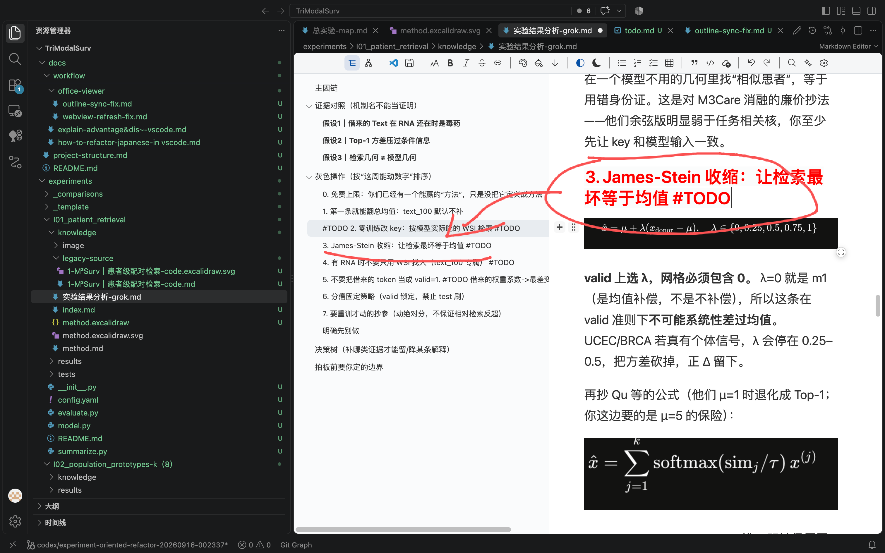

- [ ]  #BUG 修复Markdown文件使用office viewer 渲染后的md文件，没当标题的颜色进行标红等颜色标记操作，左侧渲染出来的大纲没有渲染出红色

##可参考此版本的MD文件，并且如问题修复了之后，将此问题并同步到这个MD文件中/Users/wuhao/Desktop/TriModalSurv/docs/workflow/office-viewer/outline-sync-fix.md
